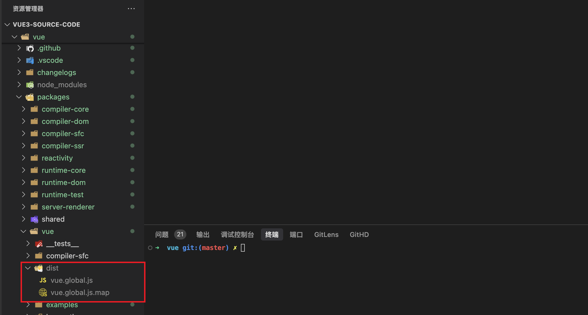
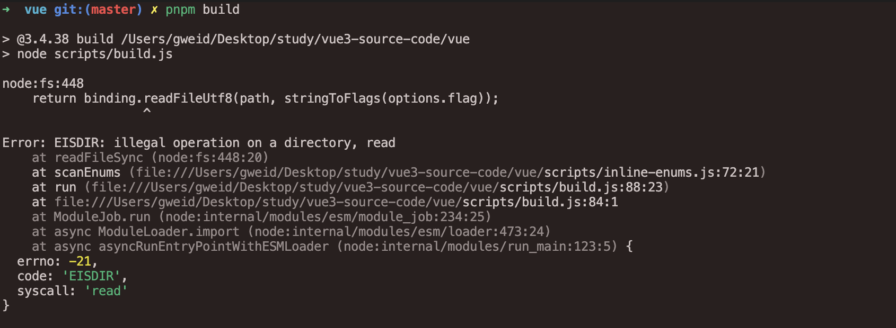

# vue3 源码阅读

基于 vue@3.4.38 版本。


## 调试方法

1. 首先，将 [vue@3.4.38](https://github.com/vuejs/core/tree/v3.4.38) 源码 clone 或者下载到本地，并进到根目录，执行 `pnpm install` 装包

   

   根据 vue 的 `.node-version` 建议，使用 node 20 版本

   如果遇到因为 puppeteer 而导致安装包失败，可以删除 package.json 中的 puppeteer 依赖，这是端到端测试用的，没影响，或者执行

   ```shell
   PUPPETEER_SKIP_DOWNLOAD=true pnpm install   # 跳过 puppeteer 安装
   ```

2. 执行 `pnpm dev` 构建 vue 开发环境产物

   > 相比而言，`npm run dev`生成的文件更少，速度更快，而且 dev 环境本身就有 sourcemap

   构建后的产物，后面需要引入这个产物进行调试

   

   

3. 如果要使用 `pnpm build` 构建，需要：

   - 找到 vue 源码目录下的 `rollup.config.js` 文件，开启 sourcemap

     ```js
     // 找到这行，将 !!process.env.SOURCE_MAP 改为 true
     output.sourcemap = !!process.env.SOURCE_MAP
     
     // 改为
     output.sourcemap = true
     ```

   - 执行 `pnpm build` 构建，如果遇到错误

     ```shell
     node:fs:448
         return binding.readFileUtf8(path, stringToFlags(options.flag));
     ```

     

     找到 `scripts/inline-enums.js` 文件，修改

     ```js
     // 2. parse matched files to collect enum info
     for (const relativeFile of files) {
       const file = path.resolve(process.cwd(), relativeFile)
       const content = readFileSync(file, 'utf-8')
     
       // .....
     }
     
     
     
     // 将上面这段修改下，改为：
     for (const relativeFile of files) {
       const file = path.resolve(process.cwd(), relativeFile)
     
       // 还要引入 statSync 包
       const stats = statSync(file)
       if (!stats.isFile()) {
         console.error(`Path ${file} is not a file`)
         continue
       }
     
       const content = readFileSync(file, 'utf-8')
     
       // .....
     }
     ```

     

4. 在 vue 源码目录下，新建 debug 目录，里面新建 index.html，用于调试

   ```html
   <!DOCTYPE html>
   <html lang="en">
   <head>
     <meta charset="UTF-8">
     <meta name="viewport" content="width=device-width, initial-scale=1.0">
     <title>Document</title>
   </head>
   <body>
     <script src="./packages/vue/dist/vue.global.js"></script>
   
     <div id="app">
       <section class="container">
         <div>
           <p>{{ state.count }}</p>
           <button @click="increment">加一</button>
         </div>
       </section>
     </div>
   
     <script>
       const {
         createApp,
         reactive,
         computed,
         watchEffect,
         onMounted,
         onUnmounted
       } = Vue
   
       createApp({
         setup() {
           const state = reactive({
             count: 0
           })
   
           const increment = () => {
             state.count++
           }
   
           return {
             state,
             increment
           }
         }
       }).mount('#app')
     </script>
   </body>
   </html>
   ```

   这样，只要在 index.html 中打上 debugger，在浏览器打开，即可进入 debug 模式


## 目录结构

基于上面的调试方式，目录结构如下：

```text
vue-source-code
├── vue                          // vue 源码目录
│   ├── debug                    // 调试 vue 源码的项目
│   │   ├── index.html           // 具体调试文件
│   ├── packages
│   │   ├── vue
│   ├── package.json
│   ├── pnpm-lock.yaml
│   └── rollup.config.js
├── .gitignore
└── readme.md
```


## 源码包说明


其中比较核心的：

- 编译时：把模版编译成 js 语法
  - compiler-core
  - compiler-dom
  - compiler-sfc
- 运行时：框架中负责处理虚拟 DOM 渲染、组件系统、响应式系统、更新等核心功能的代码部分
  - runtime-core
  - runtime-dom

- 响应式系统：
  - reactivity
