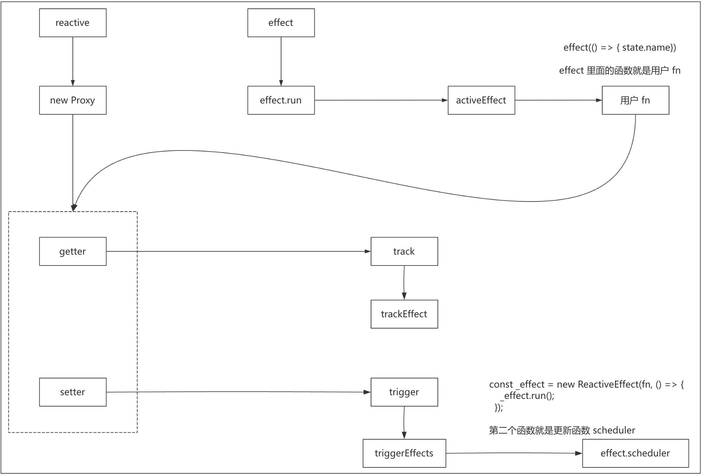

# 手写 vue3


手写 vue3 核心功能，主要包含核心包：

- 编译时：
  - compiler-core：与平台无关的核心编译模块
  - compiler-dom：与浏览器相关的编译模块
  - compiler-sfc：单文件解析
- 运行时
  - runtime-core：与平台无关的运行时核心包
  - runtime-dom：浏览器运行时
- 响应式系统
  - reactivity：响应式系统
- 包之间共享方法
  - shared：包之间共享方法


## 目录结构

```text
mini-vue
├── debug                          // 调试目录
│   ├── compiler                   // 调试编译时
│   ├── reactivity                 // 调试响应式
│   └── runtime                    // 调试运行时
├── packages                       // 手写 vue3 源码
│   ├── compiler-core
│   ├── compiler-dom
│   ├── compiler-sfc
│   ├── reactivity
│   ├── runtime-core
│   ├── runtime-dom
│   └── shared
├── scripts                        // 打包脚本
├── .npmrc                         // npm 配置
├── package.json                  
├── pnpm-lock.yaml                  
├── pnpm-workspace.yaml            // 设置 monorepo                  
└── tsconfig.json                  // ts 配置
```


## reactivity

响应式系统相关


### reactive


#### 实现 reactive

首先，看下 reactive 的使用

```js
const state = reactive({ name: 'jack' })
```

这就将一个对象变成了响应式


##### reactive 函数

```ts
// 用于记录代理后的结果，可以复用
const proxyMap = new WeakMap();


/**
 * 创建响应式对象
 * @param target 需要代理的目标
 * @returns 代理后的对象
 */
export function reactive(target) {
  return createReactiveObject(target);
}


/**
 * 创建响应式对象函数
 * @param target 需要代理的目标
 * @returns 代理后的结果
 */
function createReactiveObject(target) {
  // 统一做判断，响应式对象必须是对象
  if (!isObject(target)) {
    return target;
  }

  // 如果已经是响应式对象，直接返回
  // proxy 的 mutableHandlers 中会拦截 IS_REACTIVE 属性的访问
  // 当访问 IS_REACTIVE 属性时，返回 true。不是代理过的对象不会触发
  if (target[ReactiveFlags.IS_REACTIVE]) {
    return target;
  }

  // 取缓存，如果有直接返回
  const existingProxy = proxyMap.get(target);
  if (existingProxy) {
    return existingProxy;
  }

  // 创建代理
  let proxy = new Proxy(target, mutableHandlers);

  // 缓存代理后的结果
  proxyMap.set(target, proxy);

  return proxy;
}
```

- 通过 createReactiveObject 将对象转换为 Proxy 代理对象

  - 首先判断：响应式对象必须是对象

  - 如果已经是响应式对象，直接返回

    > proxy 的 mutableHandlers 中会拦截 IS_REACTIVE 属性的访问
    >
    > 当访问 IS_REACTIVE 属性时，返回 true。不是代理过的对象不会触发

  - 取缓存，如果有直接返回

  - 通过 new Proxy 创建响应式代理

  - 缓存代理后的结果到全局的 proxyMap


##### mutableHandlers 函数

```js
export const mutableHandlers: ProxyHandler<any> = {
  get(target, key, recevier) {
    // 拦截 IS_REACTIVE 属性的访问，当访问 IS_REACTIVE 属性时，返回 true
    // 也就是告诉这是个响应式对象，被代理过的对象才会触发，普通对象不会触发
    if (key === ReactiveFlags.IS_REACTIVE) {
      return true;
    }

    // 当取值的时候  应该让响应式属性 和 effect 映射起来
    // 收集这个对象上的属性，和 effect 关联在一起。也就是依赖收集
    // track 收集，trigger 触发
    // console.log(activeEffect);
    track(target, key);

    // state.address

    // 使用 Reflect 可以保持默认行为的一致性
    // 不使用 Reflect，那么这里是 let res = target[key]，这样会丢失 receiver 绑定
    // receiver 参数在涉及原型链或继承时非常重要。Reflect 方法会自动处理 receiver 绑定，确保 this 指向正确
    // Reflect 的方法与 Proxy handler 的方法一一对应。比如 Proxy.get 对应 Reflect.get；Proxy.set 对应 Reflect.set
    let res = Reflect.get(target, key, recevier);

    if (isObject(res)) {
      // 当取的值也是对象的时候，需要对这个对象在进行代理，递归代理
      return reactive(res);
    }

    return res;
  },
  set(target, key, value, recevier) {

    let oldValue = target[key];

    // 设置属性
    let result = Reflect.set(target, key, value, recevier);

    if (oldValue !== value) {
      // 需要触发页面更新
      trigger(target, key, value, oldValue);
    }
 
    return result;
  },
};
```

- get 函数：

  - 拦截 IS_REACTIVE 访问，当访问 IS_REACTIVE 属性时，返回 true，告诉这是个响应式对象，被代理过的对象才会触发，普通对象不会触发

  - track 收集依赖
  - 通过 Reflect.get 获取值
  - 当取的值也是对象的时候，需要对这个对象在进行代理，递归代理
  - 返回值

- set 函数：

  - 设置属性
  - 通过 trigger 触发更新（也就是让对应的 effect 执行，track 收集，trigger 触发）


#### 实现 effect

effect 的基本使用：

```ts
const state = reactive({ name: "jw" });

effect(() => {
  app.innerHTML = state.name;
});
```

effect 的作用：

- **建立依赖关系**：追踪函数执行过程中访问的所有响应式属性
- **自动重新执行**：当依赖的响应式数据变化时，自动重新运行副作用函数
- **管理副作用生命周期**：提供清理和重新调度的能力（这里暂时先忽略生命周期）


##### effect 函数

```ts
export function effect(fn, options?) {
  // 创建一个响应式effect 数据变化后可以重新执行

  // 创建一个 effect，只要依赖的属性变化了就要执行回调
  const _effect = new ReactiveEffect(fn, () => {
    // scheduler
    _effect.run();
  });

  _effect.run();

  if (options) {
    Object.assign(_effect, options); // 用用户传递的覆盖掉内置的
  }

  const runner = _effect.run.bind(_effect);
  runner.effect = _effect; // 可以在 run 方法上获取到 effect 的引用

  // 返回 runner 函数，外部使用可以自己让其重新 run
  return runner;
}
```

这里比较核心的是通过 new ReactiveEffect 创建了一个副作用


ReactiveEffect:

```ts
export let activeEffect;

export class ReactiveEffect {

  public active = true; // 创建的 effect 是响应式的

  // fn 用户编写的函数
  // 如果fn中依赖的数据发生变化后，需要重新调用 -> run()
  constructor(public fn, public scheduler) {}

  run() {
    // 让 fn 执行
    if (!this.active) {
      // 不是响应式的，执行后，什么都不用做
      return this.fn();
    }

    // ---------------- 是响应式的，需要做依赖收集

    // 这样可以处理 effect 嵌套的问题
    // effect(() => { effect(() => {}) })
    let lastEffect = activeEffect;

    try {
      // 将当前的 effect 保存到全局变量中
      // 当在 effect 副作用函数中对响应式对象取值的时候，会触发 proxy 的 get 拦截器
      // 此时就可以访问到这个全局的 activeEffect
      // const state = reactive({ name: "jw" })
      // effect(() => { app.innerHTML = state.name })
      activeEffect = this;

      // 执行副作用函数
      // 如果里面访问了 reactive，那么会执行依赖收集
      return this.fn();
    } finally {

      // 一开始 lastEffect = activeEffect，activeEffect 是 undefined
      // 当副作用函数执行完，要将 activeEffect 置为 undefined
      activeEffect = lastEffect;
    }
  }
}
```

这里比较重要的一点：将创建的副作用，绑定到了全局属性 activeEffect 上，并将 activeEffect 导出了

后面调用 this.fn() 执行副作用函数，当副作用函数里面访问响应式对象时，触发 get，就会去拿这个 activeEffect 副作用，然后进行依赖收集。比如：

```ts
const state = reactive({ name: "jw" });

effect(() => {
  app.innerHTML = state.name;
});
```

这里访问响应式对象 state 时，触发 get，在这里面进行依赖收集


#### 依赖收集

```ts
export const mutableHandlers: ProxyHandler<any> = {
  get(target, key, recevier) {
    // ...

    // 当取值的时候  应该让响应式属性 和 effect 映射起来
    // 收集这个对象上的属性，和 effect 关联在一起。也就是依赖收集
    // track 收集，trigger 触发
    // console.log(activeEffect);
    track(target, key);

    // ...

    return res;
  },
  set(target, key, value, recevier) {
    // ...
  },
};
```

当访问 reactive 值的时候，触发 get，在这里面进行依赖收集。这里通过 track 函数进行依赖收集


track 函数：

```ts
const targetMap = new WeakMap(); // 存放依赖收集的关系


/**
 * 依赖收集
 * @param target 需要收集依赖的响应式对象
 * @param key 需要收集依赖的属性
 */
export function track(target, key) {
  // activeEffect 有这个属性 说明这个 key 是在 effect 中访问的
  // 没有说明在 effect 之外访问的不用进行收集
  // 响应式系统的核心目的是当数据变化时自动执行相关的副作用函数(effect)
  // 如果一个属性的访问不是在 effect 内部发生的，那么这个访问就与任何需要自动重新执行的代码无关
  // 如果对每次属性访问都进行依赖收集，即使这些访问与响应式更新无关，将会导致：大量不必要的内存占用，性能低下
  // 所以在实际应用中，只有那些需要在数据变化时重新执行的代码才应该放在 effect 中。例如：
  //  - 模板渲染 (Vue 内部使用 effect 来实现)
  //  - 计算属性 (computed)
  //  - 侦听器 (watch)
  //  - 生命周期钩子 (onMounted, onUnmounted 等)
  //  - 自定义的副作用函数
  // 因此，依赖收集只发生在 effect 内部，确保只有真正需要响应式更新的代码才会被收集
  if (activeEffect) {

    // 依赖收集的格式如下：
    // targetMap: { obj: { 属性：Map: { effect, effect, effect } } }
    // {
    //     { name: 'jw', age: 30 }: {
    //         name: {
    //             effect, effect
    //         }
    //     }
    // }

    let depsMap = targetMap.get(target);

    if (!depsMap) {
      // 新增的依赖
      targetMap.set(target, (depsMap = new Map()));
    }

    let dep = depsMap.get(key);

    if (!dep) {
      depsMap.set(
        key,
        (dep = createDep(() => depsMap.delete(key), key)) // 后面用于清理不需要的属性
      );
    }

    // 将当前的 effect 放入到 dep（依赖映射表）中
    // 后续可以根据值的变化触发此 dep 中存放的 effect
    trackEffect(activeEffect, dep);

    console.log('targetMap: ', targetMap);
  }
}
```

- 首先会判断是否有 activeEffect，这个是在 ReactiveEffect 中赋值的

  > 为什么只需要对在 effect 内部访问的响应式数据做依赖收集呢？
  >
  > - 如果一个属性的访问不是在 effect 内部发生的，那么这个访问就与任何需要自动重新执行的代码无关
  > - 如果对每次属性访问都进行依赖收集，即使这些访问与响应式更新无关，将会导致：大量不必要的内存占用，性能低下
  > - 所以在实际应用中，只有那些需要在数据变化时重新执行的代码才应该放在 effect 中。例如：
  >   - 模板渲染 (Vue 内部使用 effect 来实现)
  >   - 计算属性 (computed)
  >   - 侦听器 (watch)
  >   - 生命周期钩子 (onMounted, onUnmounted 等)
  >   - 自定义的副作用函数

- 判断当前 reactive 是否有被收集，没有就新建

- 判断当前收集的 reactive 是否有副作用函数，没有新建

- 通过 trackEffect 将当前的副作用 activeEffect 放入到 dep（依赖映射表）中，后续可以根据值的变化触发此 dep 中存放的 effect


trackEffect 函数：

```ts
export class ReactiveEffect {
  _trackId = 0; // 用于记录当前 effect 执行了几次
  _depsLength = 0;

  deps = []; // 依赖收集数组
  
  // ....
  
}


/**
 * 收集依赖
 * @param effect 当前的 effect
 * @param dep 收集依赖的映射表 Map
 */
export function trackEffect(effect, dep) {
  // 双向依赖关系：
  //   属性 → effect：通过 WeakMap<target, Map<key, Dep>> 结构存储
  //   effect → 属性：通过 effect.deps 数组存储
  // 这种双向引用使得清理时可以高效地解除关联
  dep.set(effect, effect._trackId); // 更新 id

  effect.deps[effect._depsLength++] = dep; // 永远按照本次最新的来存放
}
```

Vue 3 维护着**双向依赖关系**：

- **属性 → effect**：通过 `WeakMap<target, Map<key, Dep>>` 结构存储
- **effect → 属性**：通过 `effect.deps` 数组存储

这种双向引用使得清理时可以高效地解除关联


#### 派发更新


```ts
export const mutableHandlers: ProxyHandler<any> = {
  get(target, key, recevier) {
    // ...
  },
  set(target, key, value, recevier) {

    // 获取老值
    let oldValue = target[key];

    // 设置新值
    let result = Reflect.set(target, key, value, recevier);

    // 新旧值不一致，需要派发更新
    if (oldValue !== value) {
      // 派发更新（更新页面）
      trigger(target, key, value, oldValue);
    }

    // 返回新值
    return result;
  },
};
```

当改变 reactive 值的时候，触发 set，在这里面进行派发更新


trigger 函数：

```ts
/**
 * 派发更新
 * @param target 响应式对象
 * @param key 需要更新的属性
 * @param newValue 新值
 * @param oldValue 老值
 * @returns 
 */
export function trigger(target, key, newValue, oldValue) {
  const depsMap = targetMap.get(target);

  if (!depsMap) {
    // 找不到，说明没有存储副作用函数，直接 return 即可
    return;
  }

  let dep = depsMap.get(key);

  if (dep) {
    // 修改的属性对应 effect 数组
    triggerEffects(dep);
  }
}
```


triggerEffects 函数：

```ts
/**
 * 派发更新
 * @param dep 副作用 Map
 */
export function triggerEffects(dep) {
  // 遍历所有副作用 effect，依次执行
  for (const effect of dep.keys()) {

    // new ReactiveEffect 创建 effect 的时候，传递了更新函数
    if (effect.scheduler) {
      // 如果有更新函数，则执行更新函数，-> effect.run()
      effect.scheduler();
    }
  }
}
```


#### 依赖清理


##### 问题


上面的依赖收集与派发更新几个问题，比如：


**问题 1：**

```ts
const state = reactive({ flag: true, name: "jw", age: 18 });

effect(() => {
  app.innerHTML = state.flag ? state.name : state.age;
});

setTimeout(() => {
  state.flag = false;
}, 1000);
```

当根据 flag 变化，产生不同结果，一开始是收集 [flag, name] 这两个依赖，但是 flag 变了之后，如果按照上面实现的逻辑，会变成 [flag, name, age]，但是此时已经不需要收集 name 依赖了。这造成了重复


**问题 2：**

```ts
effect(() => {
  app.innerHTML = state.flag ? state.name + state.name : state.age;
});
```

当同一个 effect 同时访问两次 name 时，effect.deps 中收集到的依赖是 [flag, name, name]。重复收集了 name 依赖


所以，在 effect 副作用重新执行前，需要清理旧的依赖关系。这就是 vue3 的依赖预清理机制，是 vue 3 响应式系统的一个重要优化，它确保：

- 只有当前实际依赖的数据才会触发 effect 的重新执行，避免了不必要的更新计算
- 防止因条件分支变化导致的无效依赖残留
- 避免不再使用的依赖关系持续占用内存
- 防止了由于依赖变化导致的"幽灵更新"问题


##### 实现

既然是在 effect 副作用重新执行前，需要清理旧的依赖关系，那么就是在 effect.run 函数中

```ts
export class ReactiveEffect {
  _trackId = 0; // 用于记录当前 effect 执行了几次
  _depsLength = 0;
  _running = 0;

  deps = []; // 依赖收集数组

  public active = true; // 创建的 effect 是响应式的

  // ...

  run() {
    // ...

    try {
      // ...

      // 在 effect 副作用重新执行前清理旧的依赖关系
      // 即依赖预清理机制，是 Vue 3 响应式系统的一个重要优化，它确保：
      //  - 只有当前实际依赖的数据才会触发 effect 的重新执行
      //  - 避免了不必要的更新计算
      //  - 防止了由于依赖变化导致的"幽灵更新"问题
      preCleanupEffect(this);

      this._running++;

      // 执行副作用函数
      // 如果里面访问了代理过的响应式对象，那么会在代理对象的 get 中执行依赖收集
      return this.fn();
    } finally {
      this._running--;
      
      // 如果非初始化阶段（即更新阶段），经过 trackEffect 后，会调用 cleanDepEffect 删除没有用到的依赖
      // 但是那边遗留了一个问题，就是新旧依赖数组长度不一致的时候，多的依赖没有删除
      // 所以需要 postCleanupEffect 来删除多余的依赖
      postCleanupEffect(this);

      // ...
    }
  }
}


function preCleanupEffect(effect) {
  // 这里设置 _depsLength 为 0，将指针回到初始位置，相当于清理旧依赖
  // 因为在 trackEffect 中，是通过 effect.deps[effect._depsLength++] = dep 这样来收集依赖的
  effect._depsLength = 0;

  // 每次执行 _trackId 都是 +1， 如果当前同一个 effect 执行，_trackId 就是相同的
  // 举例：effect(() => { state.name + state.name + state.name })
  // 如果
  effect._trackId++;
}
```


trackEffect 函数中：

```ts
export function trackEffect(effect, dep) {

  if (dep.get(effect) !== effect._trackId) {
    // 双向记忆：收集器 dep 记录了 effect，effect 中的 deps 数组记录了收集器 dep
    dep.set(effect, effect._trackId); // 更新 id

    // { flag, name }、{ flag, age }
    let oldDep = effect.deps[effect._depsLength];

    // 如果不相等，那么就是新的依赖
    // 有两种情况：
    //  - 初始化，那么肯定不相等
    //  - 需要收集的依赖变更了（effect(() => app.innerHTML = state.flag ? state.name : state.age)）
    //    比如上面，根据条件变化，需要收集的依赖从 flag,name 变为了 flag,age
    if (oldDep !== dep) {
      if (oldDep) {
        // 删除掉老的
        cleanDepEffect(oldDep, effect);
      }

      // effect 中的 deps 数组记录了 收集器 dep
      // _depsLength++ 确保后面一个属性的收集在数组的位置正确
      effect.deps[effect._depsLength++] = dep; // 永远按照本次最新的来存放
    } else {
      // 依赖不变
      effect._depsLength++;
    }
  }
}
```


依赖预清理：

- 首先，在 effect 执行之前的 run 函数中，通过 preCleanupEffect：

  - 设置 effect._depsLength = 0
  - 设置 effect._trackId++（\_trackId 主要用来记录当前 effect 执行的次数）

- 然后，在重新触发代理对象 get 函数，依赖重新收集时

  - 首先判断 dep.get(effect) !== effect._trackId，这个不相等，有两种情况：

    - 初始化的时候，肯定不相等

    - 需要收集的依赖变更，会重新执行 effect.run，preCleanupEffect 会将 _trackId ++，此时就不相等了

      > 这样就有效避免了一个 effect 中重复依赖的收集
      >
      > 比如：effect(() => { app.innerHTML = state.name + state.name })

  - 然后通过 effect.deps[effect._depsLength] 获取旧的依赖

    - 这里在 preCleanupEffect 函数中，已经将 effect._depsLength 重置为 0 了
    - 对比当前依赖和旧依赖，删除非本次需要收集的依赖

- 最后，调用 postCleanupEffect 清除多余的依赖（因为上面一步，只做了依赖更新，没有做多余的依赖删除）

  > 如果非初始化阶段（即更新阶段），经过 trackEffect 后，会调用 cleanDepEffect 删除没有用到的依赖
  >
  > 但是那边遗留了一个问题，就是新旧依赖数组长度不一致的时候，多的依赖没有删除
  >
  > 所以需要 postCleanupEffect 来删除多余的依赖


#### effect 调度

effect 调度：数据更新了，不重新渲染，自行调度


**基本使用：**

```ts
const state = reactive({ name: "张三" });

const runner = effect(() => {
  app.innerHTML = state.name;
}, {
  scheduler() {
    console.log('数据更新了，不重新渲染，走这里面的逻辑');

    runner();
  }
});

setTimeout(() => {
  state.name = '李四';
}, 1000);
```


**实现 effect 调度：**

```js
export class ReactiveEffect {
  // ....

  // fn 用户编写的函数
  // 如果fn中依赖的数据发生变化后，需要重新调用 -> run()
  constructor(public fn, public scheduler) {}
  
  // ...
}


export function effect(fn, options?: ReactiveEffectOptions) {
  // 创建一个 effect，只要依赖的属性变化了就要执行回调
  const _effect = new ReactiveEffect(fn, () => {
    // scheduler
    _effect.run();
  });

  // 直接触发一次
  _effect.run();

  if (options) {
    // 用用户传递的覆盖掉内置的，比如 scheduler
    Object.assign(_effect, options);
  }

  const runner = _effect.run.bind(_effect);
  runner.effect = _effect; // 可以在 runner 方法上获取到 effect 的引用

  // 返回 runner 函数，外部使用可以自己让其重新 run
  return runner;
}
```

实现也很简单：

- 当有传 options 参数，那么使用传递的覆盖掉内置的 scheduler
- 定义一个 runner 为 effect.run()，返回，即可在外部访问这个 run


#### 深度代理

当绑定的属性是深层对象时，需要将要将里面的对象也转换成响应式


**实现：**

```ts
export const mutableHandlers: ProxyHandler<any> = {
  get(target, key, recevier) {

    // ...

    let res = Reflect.get(target, key, recevier);

    if (isObject(res)) {
      // 当取的值也是对象的时候，需要对这个对象在进行代理，递归代理
      return reactive(res);
    }

    return res;
  },
  set(target, key, value, recevier) {
    // ...
  },
};
```


#### 总结 reactive



- 首先，通过 reactive 函数，利用 Proxy 代理，将数据转换成响应式的
  - 当是深层对象，要将里面的对象也转换成响应式
- 然后，effect 执行副作用函数，在副作用函数中如果访问了响应式对象属性，那么会触发代理对象的 get 函数
- 在代理对象的 get 函数中，会对访问的属性进行依赖收集
  - 但是这里会有重复收集依赖的问题，所以在执行 effect 副作用函数之前（即还没有触发代理对象的 get 之前），先将上一次收集的依赖进行预清理，
- 然后在进行代理对象的修改时，触发代理对象的 set 函数，在这里进行派发更新


### ref

ref 是基于 reactive 实现的，内部实际上使用的是 reactive

```ts
// 类似 reactive({ value: true })
const flag = ref(true)
```


#### 实现 ref

**基本使用：**

```ts
const state = ref('张三');

const runner = effect(() => {
  app.innerHTML = state.value;
});

setTimeout(() => {
  state.value = '李四';
}, 1000);
```


**实现：**

```ts
export function isRef(value) {
  return value && value.__v_isRef;
}


export function ref(value) {
  return createRef(value);
}


function createRef(rawValue) {
  // 如果 rawValue 是 ref 对象，则直接返回
  if (isRef(rawValue)) {
    return rawValue;
  }

  return new RefImpl(rawValue);
}


class RefImpl {
  public __v_isRef = true; // 增加 ref 标识
  public _value; // 用来保存 ref 的值的
  public _rawValue; // 用来保存 ref 的原始值的(即旧数据)
  public dep; // 用于收集对应的 effect

  constructor(value) {
    this._rawValue = value
    this._value = toReactive(value)
  }

  get value() {
    // 收集依赖
    trackRefValue(this);

    return this._value;
  }

  set value(newValue) {
    // 比较新旧数据有没有变化，有变化才需要派发更新
    if (newValue !== this._rawValue) {
      this._rawValue = newValue; // 更新值
      this._value = toReactive(newValue);

      // 派发更新
      triggerRefValue(this);
    }
  }
}
```

ref 是基于 reactive 的，如果是基本类型，直接取值，如果是对象，使用 toReactive 转换为响应式对象


**依赖收集：**

```ts
export function trackRefValue(ref) {
  if (activeEffect) {
    trackEffect(
      activeEffect,
      (ref.dep = ref.dep || createDep(() => (ref.dep = undefined), "undefined"))
    );
  }
}
```

可以看到，是调用的 trackEffect。此时 activeEffect 是在执行副作用函数 effect 时调用 effect.run 赋值上的


**派发更新：**

```ts
export function triggerRefValue(ref) {
  let dep = ref.dep;
  if (dep) {
    triggerEffects(dep); // 触发依赖更新
  }
}
```

可以看到，调用的 triggerEffects


#### 实现 toRef 与 toRefs


**基本使用：**

```ts
const state = reactive({ name: '张三', age: 18 });

const stateRef = toRef(state, 'name');

const stateRefs = toRefs(state);

const { age } = stateRefs;

const runner = effect(() => {
  app.innerHTML = `name: ${stateRef.value}, age: ${age.value}`;
});

setTimeout(() => {
  stateRef.value = '李四';
  age.value = 20;
}, 1000);
```

toRef 与 toRefs：

- toRef：可以为**响应式对象(`reactive`)**的某个属性创建一个 ref 引用，**保持对该属性的响应性**。场景：
  - 提取单个属性保持响应性
  - 需要单独操作某个响应式对象属性时
- toRefs：将一个响应式对象转换为普通对象，**但是这个普通对象可以解构而不会失去响应性**


**实现：**

```ts
class ObjectRefImpl {
  public __v_isRef = true; // 增加 ref 标识

  constructor(public _object, public _key) {}

  get value() {
    return this._object[this._key];
  }

  set value(newValue) {
    this._object[this._key] = newValue;
  }
}

export function toRef(object, key) {
  return new ObjectRefImpl(object, key);
}

export function toRefs(object) {
  const res = {};
  for (let key in object) {
    // 挨个属性调用 toRef
    res[key] = toRef(object, key);
  }
  return res;
}
```

主要是 ObjectRefImpl 类，将访问和设置值变为 getter 和 setter 形式


#### 实现 proxyRef

proxyRef 作用：自动解包 ref 引用，使得在访问对象属性时不需要显式使用 `.value`

这个方法比较少手动使用，一般在模版渲染的时候，自动使用，所以在模版中的 ref 不需要 .value


**使用：**

```ts
const state = reactive({ name: '张三', age: 18 });

const stateRefs = toRefs(state);

const proxyState = proxyRefs({ ...stateRefs });

effect(() => {
  // 使得 ref 不用使用 .value 就可以访问到值
  app.innerHTML = `name: ${proxyState.name}, age: ${proxyState.age}`;
});
```


**实现：**

```ts
export function proxyRefs(objectWithRef) {
  // 通过 proxy 代理
  return new Proxy(objectWithRef, {
    get(target, key, receiver) {
      let r = Reflect.get(target, key, receiver);

      // 如果 r 是 ref 对象，则返回 r.value，外部使用就不需要 .value 了
      return r.__v_isRef ? r.value : r;
    },
    set(target, key, value, receiver) {
      const oldValue = target[key];
      if (oldValue.__v_isRef) {
        oldValue.value = value; // 如果老值是 ref 需要给 ref 赋值
        return true;
      } else {
        return Reflect.set(target, key, value, receiver);
      }
    },
  });
}
```

通过 Proxy 将对象转换为响应性。通过 getter 和 setter 拦截访问和设置值，自动补上 .value


### computed

计算属性：基于响应式依赖进行缓存，只有在其依赖的响应式数据发生变化时才会重新计算


**基本使用：**

```ts
const state = reactive({ name: "张三" });


// 函数方式
const aliasName = computed(() => ("**" + state.name))


// 对象方式
const aliasName = computed({
  get(oldValue) {
    console.log("runner", oldValue);
    return "**" + state.name;
  },
  set(newValue) {
    state.name = newValue;
  },
});


// 副作用
effect(() => {
  app.innerHTML = aliasName.value;
});
```


**computed 函数**

```ts
export function computed(getterOrOptions) {
  // 判断是否是函数, computed 有两种使用方式
  // computed(() => state.name)  // 这种是只有 getter
  // computed({ get: () => state.name, set: () => {} }) // 这种是既有 getter 又有 setter
  let onlyGetter = isFunction(getterOrOptions);

  let getter;
  let setter;

  if (onlyGetter) {
    // computed 参数是函数
    getter = getterOrOptions;
    setter = () => {};
  } else {
    getter = getterOrOptions.get;
    setter = getterOrOptions.set;
  }

  // 创建一个计算属性
  return new ComputedRefImpl(getter, setter); // 计算属性ref
}
```


**ComputedRefImpl 类：**

```ts
export class ComputedRefImpl<T> {
  public _value;
  public effect;
  public dep; // 依赖收集器

  constructor(getter, public setter) {
    // 创建一个 effect 来关联当前计算属性的 dirty 属性
    this.effect = new ReactiveEffect(
      () => getter(this._value), // 用户的 fn  state.name
      () => {
        // 这里就是 computed 的 setter，setter 中做派发更新
        // 计算属性依赖的值变化了，应该触发渲染 effect 重新执行
        triggerRefValue(this); // 依赖的属性变化后需要触发重新渲染，还需要将 dirty 变为 true
      }
    );
  }

  get value() {
    // 计算属性维护了一个 dirty（脏值），默认是 true，需要计算
    // 运行过一次后，dirty 变为 false，后面不在计算，使用上次的缓存值
    // 当依赖的值变化后，dirty 变为 true，需要重新计算
    // 让计算属性收集对应的 effect，当依赖的值变化后，会触发 effect 的重新执行
    if (this.effect.dirty) {
      // 有脏值，需要重新计算

      // 默认取值一定是脏的，但是执行一次 run 后就不脏了
      this._value = this.effect.run();

       /**
       * ! computed 依赖收集，收集 渲染 effect
       * ! 注意，这里收集的是渲染 effect，为什么呢？
       *   首先 const aliasName = computed({ get() { return state.name } })，这里 cpmputed
       */
      // 如果当前在 effect 中访问了计算属性，计算属性是可以收集这个 effect 的
      // 也就是计算属性本身收集 渲染 effect，区别依赖属性收集 computed effect
      trackRefValue(this);
    }

    // 没有脏值，直接返回
    return this._value;
  }

  set value(newValue) {
    // 这个就是 ref 的 setter
    this.setter(newValue);
  }
}
```

- 首先，初始化 ComputedRefImpl 类的时候，会创建一个 computed effect 来关联当前计算属性的 dirty 属性

  - 这个 computed effect 的 scheduler 函数，会进行派发更新，依赖的属性变化后需要触发重新渲染，还需要将 dirty 变为 true

    ```ts
    this.effect = new ReactiveEffect(
      () => getter(this._value), // 用户的 fn  state.name
      () => {
        // 这里就是 computed 的 setter，setter 中做派发更新
        // 计算属性依赖的值变化了，应该触发渲染 effect 重新执行
        triggerRefValue(this); // 依赖的属性变化后需要触发重新渲染，还需要将 dirty 变为 true
      }
    );
    ```

    triggerRefValue --> triggerEffects 中：

    ```ts
    export function triggerEffects(dep) {
      // 遍历所有副作用 effect，依次执行
      for (const effect of dep.keys()) {
        // 当前这个值是不脏的，但是触发更新需要将值变为脏值
        // 属性依赖了计算属性，需要让计算属性的 drity 在变为 true
        if (effect._dirtyLevel < DirtyLevels.Dirty) {
          effect._dirtyLevel = DirtyLevels.Dirty;
        }
    
        // _running > 0 代表当前 effect 正在执行
        // effect 正在执行，不要调用 scheduler，防止递归调用，进入死循环
        if (!effect._running) {
    
          // new ReactiveEffect 创建 effect 的时候，传递了更新函数
          if (effect.scheduler) {
            // 如果有更新函数，则执行更新函数，-> effect.run()
            effect.scheduler();
          }
        }
      }
    }
    ```

- getter 方法：判断 computed effect 的 dirty（脏值），如果是脏值，重新执行 effect.run() 进行计算，调用 trackRefValue 收集 computed 的依赖；没有脏值，直接返回缓存结果

  - 当执行了一次 effect.run()  之后，会将 dirty 设置为 false，那么后续如果依赖的属性没有变化，不会重新计算

    ```ts
    export class ReactiveEffect {
      _dirtyLevel = DirtyLevels.Dirty;
    
    
      // fn 用户编写的函数
      // 如果fn中依赖的数据发生变化后，需要重新调用 -> run()
      constructor(public fn, public scheduler) {}
    
      public get dirty() {
        // 访问 dirty 属性，会触发 get 拦截器
        return this._dirtyLevel === DirtyLevels.Dirty;
      }
    
      public set dirty(value) {
        this._dirtyLevel = value ? DirtyLevels.Dirty : DirtyLevels.NoDirty;
      }
    
      run() {
        // 每次运行后 effect 变为 no_dirty
        // 主要是给 computed 做缓存用的，当不是脏值，那么就返回上一次缓存的值
        this._dirtyLevel = DirtyLevels.NoDirty;
    
        // ...
      }
    }
    ```

  - 然后调用 trackRefValue ，**computed 做依赖收集，这里收集的是 render effect**

    > 为什么是 computed 收集到的是 render effect 呢？
    >
    > ```ts
    > const state = reactive({ name: "张三" });
    > 
    > const aliasName = computed({
    >   get(oldValue) {
    >     console.log("runner", oldValue);
    >     return "**" + state.name;
    >   },
    >   set(newValue) {
    >     state.name = newValue;
    >   },
    > });
    > 
    > 
    > effect(() => {
    >   app.innerHTML = aliasName.value;
    > });
    > ```
    >
    > - 首先调用 computed 会调用 new ReactiveEffect 来创建一个 computed effect
    >
    > - 接着 effect 调用，effect 会通过 new ReactiveEffect 得到一个 render effect，并且执行一次 render effect.run()，此时全局 activeEffect 被设置为 render effect
    >
    > - effect 中访问 aliasName.value，触发 computed 的 getter 函数，这里面调用一次 computed effect.run()，run 中：
    >
    >   - 首先使用 lastEffect 保存 activeEffect（上面设置成了 render effect，也就是此时的 lastEffect 是 render effect）
    >
    >   - 将 activeEffect 设置为 computed effect
    >
    >   - 然后调用 computed effect 的 fn 函数，即这里面的 `() => getter(this._value)` 这一块
    >
    >     ```ts
    >     export class ComputedRefImpl<T> {
    >       public effect; // 计算属性依赖
    >         
    >       constructor(getter, public setter) {
    >         // 创建一个 effect 来关联当前计算属性的 dirty 属性
    >         this.effect = new ReactiveEffect(
    >           () => getter(this._value), // 用户的 fn
    >           // 这个实际就是 schedule 函数
    >           () => {
    >             // 这里就是 computed 的 setter，setter 中做派发更新
    >             // 计算属性依赖的值变化了，应该触发渲染 effect 重新执行
    >             triggerRefValue(this); // 依赖的属性变化后需要触发重新渲染，还需要将 dirty 变为 true
    >           }
    >         );
    >       }
    >     }
    >     
    >     
    >     // () => getter(this._value) 是调用的 getter，就是下面的 get
    >     const aliasName = computed({
    >       get(oldValue) {
    >         console.log("runner", oldValue);
    >         return "**" + state.name;
    >       },
    >       set(newValue) {
    >         state.name = newValue;
    >       },
    >     });
    >     ```
    >    
    >     这一段，这一段会访问 state.name，触发 state.name 的 getter 函数，进行依赖收集，因为上面将 activeEffect 设置为 computed effect，所以这里的 state.name 收集到的依赖是  computed effect
    >
    >   - 执行完之后，设置 activeEffect = lastEffect，那么此时的 activeEffect 变成了 render effect
    >
    > - 继续回到 computed getter 中，执行完 computed effect.run() 之后，调用 trackRefValue 为 computed 收集依赖。此时的 activeEffect 已经是 render effect 了，所以 computed 收集到的是 render effect
    >
    > 
    >
    > 这里很巧妙的设计：通过 state.name 关联 computed effect，computed 关联 render effect，当 state.name 变化，触发 computed effect 设置 dirty 为 true，并调用 computed effect 的 scheuler，scheuler 调用 computed 收集的 render effect 进行更新
    >
    > ```ts
    > this.effect = new ReactiveEffect(
    >   () => getter(this._value), // 用户的 fn  state.name
    >   // 这个实际就是 schedule 函数
    >   () => {
    >     // 这里就是 computed 的 setter，setter 中做派发更新
    >     // 计算属性依赖的值变化了，应该触发渲染 effect 重新执行
    >     triggerRefValue(this); // 依赖的属性变化后需要触发重新渲染，还需要将 dirty 变为 true
    >   }
    > );
    > ```

- setter 方法：就是调用的 computed 的 setter


这里需要捋一下 computed effect 与其它 effect

- 计算属性维护了一个 dirty 属性，默认就是 true，稍后运行过一次会将 dirty 变为 false，并且稍后依赖的值变化后会再次让 dirty 变为 true
- 计算属性也是一个 effect，依赖的属性会收集这个computed effect，当前值变化后，会让 computed effect 里面 dirty 变为 true
- 计算属性具备收集能力的，可以收集对应依赖的 render effect，依赖的值变化后会触发 render effect 重新执行


## runtime

运行时相关


### watch

实际上，watch 不属于 reactivity，而是 runtime-core


#### 实现 watch

**基本使用：**

```ts
const numState = ref(18);
const state = reactive({ name: "张三" });

effect(() => {
  app.innerHTML = `学号: ${refState.value} --- 姓名: ${state.name}`;
});

watch(numState, (newVal, oldVal) => {
  console.log('numState 变化了：', newVal, oldVal);
});

watch(() => state.name, (newVal, oldVal) => {
  console.log('state.name 变化了：', newVal, oldVal);
});

setTimeout(() => {
  state.name = "李四";
  refState.value = 20;
}, 1000);
```


**实现：**

```ts
export function watch(source, cb, options = {} as any) {
  return doWatch(source, cb, options);
}


function doWatch(source, cb, { deep, immediate }) {
  // source --> getter
  const reactiveGetter = (source) =>
    traverse(source, deep === false ? 1 : undefined);

  // 产生一个可以给 ReactiveEffect 来使用的 getter
  // 需要对这个对象进行取值操作，会关联当前的 reactiveEffect
  let getter;
  if (isReactive(source)) {
    // reactive 对象，默认开启深度监听
    getter = () => reactiveGetter(source);
  } else if (isRef(source)) {
    // ref
    getter = () => source.value;
  } else if (isFunction(source)) {
    // 函数
    getter = source;
  }

  let oldValue;

  let clean;
  const onCleanup = (fn) => {
    clean = () => {
      fn();
      clean = undefined;
    };
  };

  // 相当于 ReactiveEffect 的 scheduler
  const job = () => {
    if (cb) {
      const newValue = effect.run();

      if (clean) {
        clean(); //  在执行回调前，先调用上一次的清理操作进行清理
      }

      cb(newValue, oldValue, onCleanup);
      oldValue = newValue;
    } else {
      effect.run(); // watchEffect
    }
  };


  const effect = new ReactiveEffect(getter, job);

  oldValue = effect.run();

  const unwatch = () => {
    effect.stop();
  };

  return unwatch;
}


// 控制 depth 当前遍历到了那一层
// 这里的 source 就是 reactive 对象
function traverse(source, depth, currentDepth = 0, seen = new Set()) {
  if (!isObject(source)) {
    return source;
  }

  // 如果手动关闭了 deep，那么 depth = 1
  // 其它情况，depth = undefined，不会走下面逻辑
  if (depth) {
    if (currentDepth >= depth) {
      return source;
    }
    currentDepth++; // 根据deep 属性来看是否是深度
  }

  // 防止循环递归
  if (seen.has(source)) {
    return source;
  }

  // 遍历 reactive 对象的每个属性
  // 主要作用：触发每个属性的 getter 操作，进行依赖收集
  // ! 这里收集到的是 watch effect
  for (let key in source) {
    traverse(source[key], depth, currentDepth, seen);
  }

  return source; // 遍历就会触发每个属性的get
}
```

主要逻辑在 doWatch 函数中：

- 产生一个可以给 ReactiveEffect 来使用的 getter，**这个 getter 的作用就是，当访问 state 属性的时候，触发 getter 进行依赖收集，将 watch effect 收集起来**
  - 当是 reactive，通过 traverse 函数遍历 reactive 所有属性，触发 getter 进行依赖收集
    - traverse 函数还做了一件事，就是如果关闭或者手动设置了深度检测 deep 的值，会处理依赖收集的层级
  - ref 时，访问 ref.value 触发 getter 进行依赖收集
  - 是函数时，() => state.name 也会访问属性触发 getter 依赖收集
- 产生一个 ReactiveEffect 的 scheduler（即上面的 job）
- 当 state 属性变更，触发收集到的 watch effect 进行更新，即调用 watch effect 的 scheduler 函数，获取新值


#### 实现 watchEffect

```ts
export function watchEffect(source, options = {}) {
  // 没有 cb 就是watchEffect
  return doWatch(source, null, options as any);
}


function doWatch(source, cb, { deep, immediate }) {
  // source --> getter
  const reactiveGetter = (source) =>
    traverse(source, deep === false ? 1 : undefined);

  // 产生一个可以给 ReactiveEffect 来使用的 getter
  // 需要对这个对象进行取值操作，会关联当前的 reactiveEffect
  let getter;
  if (isReactive(source)) {
    // reactive 对象，默认开启深度监听
    getter = () => reactiveGetter(source);
  } else if (isRef(source)) {
    // ref
    getter = () => source.value;
  } else if (isFunction(source)) {
    // 函数
    getter = source;
  }

  let oldValue;

  let clean;
  const onCleanup = (fn) => {
    clean = () => {
      fn();
      clean = undefined;
    };
  };

  // 相当于 ReactiveEffect 的 scheduler
  const job = () => {
    if (cb) {
      const newValue = effect.run();

      if (clean) {
        clean(); //  在执行回调前，先调用上一次的清理操作进行清理
      }

      cb(newValue, oldValue, onCleanup);
      oldValue = newValue;
    } else {
      effect.run(); // watchEffect
    }
  };

  console.log("=========ReactiveEffect 的 fn 函数：", getter.toString());
  const effect = new ReactiveEffect(getter, job);

  if (cb) {
    // 有回调函数，是 watch
    if (immediate) {
      // 立即先执行一次用户的回调，传递新值和老值
      job();
    } else {
      oldValue = effect.run();
      console.log("=========oldValue：", oldValue);
    }
  } else {
    // 没有回调函数，那么是 watchEffect
    effect.run(); // 直接执行即可
  }

  const unwatch = () => {
    effect.stop();
  };

  return unwatch;
}
```

- watchEffect 很简单，是在 watch 的基础上实现的
- 没有传回调函数的，就是 watchEffect
- 如果是 watchEffect，直接执行一次  effect.run()


### runtime-dom

与浏览器平台相关的运行时，它的作用就是提供DOM API (提供一系列 DOM 操作的 API 方法)。

首先，三个概念：

- createRenderer: 可以自定义渲染器 （用自己提供渲染的方式）
- render: 内置的渲染器 （渲染dom元素的）
- h 函数: 创建一个虚拟 DOM; h(type,propsOrChildren,children)


而 runtime-dom 的核心就是：通过 createRenderer 创建一个浏览器平台的 render


#### runtime-dom

```ts
import { nodeOps } from "./nodeOps";
import patchProp from "./patchProp";

import { createRenderer } from "@vue/runtime-core";

// 将节点操作和属性操作合并在一起
const renderOptions = Object.assign({ patchProp }, nodeOps);

// render 方法采用 dom api 来进行渲染
export const render = (vnode, container) => {
  return createRenderer(renderOptions).render(vnode, container);
};

export * from "@vue/runtime-core";
```

- 可以看到，首先合并节点操作（nodeOps）和 属性操作（patchProp）成 renderOptions
- 基于 createRenderer 创建一个浏览器渲染 render。createRenderer 自定义渲染器的实现在下面


#### nodeOps

```ts
// 主要是对节点元素的增删改查
export const nodeOps = {
  // 如果第三个元素不传递 === appendChild
  insert: (el, parent, anchor) => parent.insertBefore(el, anchor || null),
  // appendChild  parent.insertBefore(el,null)
  remove(el) {
    // 移除dom元素
    const parent = el.parentNode;
    parent && parent.removeChild(el);
  },
  createElement: (type) => document.createElement(type),
  createText: (text) => document.createTextNode(text),
  setText: (node, text) => (node.nodeValue = text), // 设置文本
  setElementText: (el, text) => (el.textContent = text),
  parentNode: (node) => node.parentNode,
  nextSibling: (node) => node.nextSibling,
};
```

对节点的操作，比如：createElement、createText 等


#### patchProp

```ts
// 主要是对节点元素的属性操作 class style event 普通属性
import patchAttr from "./modules/patchAttr";
import patchClass from "./modules/patchClass";
import patchEvent from "./modules/patchEvent";
import patchStyle from "./modules/patchStyle";


export default function patchProp(el, key, prevValue, nextValue) {
  if (key === "class") {
    return patchClass(el, nextValue);
  } else if (key === "style") {
    return patchStyle(el, prevValue, nextValue);
  } else if (/^on[^a-z]/.test(key)) {
    // el.addEventerListener(key,prevValue)  // ()=> nextValue()
    return patchEvent(el, key, nextValue);
  } else {
    return patchAttr(el, key, nextValue);
  }
}
```

对属性的各种操作，比如处理：class、style、on 指令 等


### h 函数

在实现 createRenderer 之前，先看下怎么生成虚拟 DOM

Vue3 中，创建虚拟 DOM 节点（VNode）的核心函数是 h 函数


**h 函数：**

```ts
/**
 * 创建虚拟 DOM 节点
 * @param type 元素类型
 * @param propsOrChildren 元素属性或子节点
 * @param children 子节点
 * @returns 虚拟 DOM 节点
 */
export function h(type, propsOrChildren?, children?) {
  let l = arguments.length;

  // 参数长度是 2：h('div', '哈哈哈哈')
  if (l === 2) {
    // h(h1,虚拟节点|属性)
    if (isObject(propsOrChildren) && !Array.isArray(propsOrChildren)) {
      // 虚拟节点
      if (isVnode(propsOrChildren)) {
        // h('div',h('a'))
        return createVnode(type, null, [propsOrChildren]);
      } else {
        // 属性
        return createVnode(type, propsOrChildren);
      }
    }

    return createVnode(type, null, propsOrChildren);
  } else {
    if (l > 3) {
      // 参数长度大于 3，那么从第三个参数开始都是子节点
      children = Array.from(arguments).slice(2);
    }

    if (l == 3 && isVnode(children)) {
      children = [children];
    }

    // == 3  | == 1
    return createVnode(type, propsOrChildren, children);
  }
}
```

- 判断参数的长度，分别创建虚拟 DOM
  - 参数长度是 2，第二个参数可能是属性，或者子节点
  - 参数长度是2，第二个参数是属性，第三个参数是子节点
  - 参数长度是4，从第三个参数开始都是子节点
- 最后，都是调用的 createVnode 创建虚拟 DOM


**createVnode 函数：**

```ts
/**
 * 创建虚拟 DOM 节点
 * @param type 元素类型
 * @param props 元素属性
 * @param children 子节点
 * @returns 虚拟 DOM 节点
 */
export function createVnode(type, props, children?) {
  const shapeFlag = isString(type)
    ? ShapeFlags.ELEMENT // 元素
    : isTeleport(type)
    ? ShapeFlags.TELEPORT
    : isObject(type)
    ? ShapeFlags.STATEFUL_COMPONENT
    : isFunction(type)
    ? ShapeFlags.FUNCTIONAL_COMPONENT // 组件
    : 0;

  // 虚拟 DOM 节点
  const vnode = {
    __v_isVnode: true,
    type,
    props,
    children,
    key: props?.key, // diff算法后面需要的key
    el: null, // 虚拟节点需要对应的真实节点是谁
    shapeFlag,
    ref: props?.ref,
    patchFlag,
  };

  if (currentBlock && patchFlag > 0) {
    currentBlock.push(vnode);
  }

  if (children) {
    // 设置 子节点的 shapeFlag 标识
    if (Array.isArray(children)) {
      vnode.shapeFlag |= ShapeFlags.ARRAY_CHILDREN;
    } else if (isObject(children)) {
      vnode.shapeFlag |= ShapeFlags.SLOTS_CHILDREN; // 组件的孩子
    } else {
      children = String(children);
      vnode.shapeFlag |= ShapeFlags.TEXT_CHILDREN;
    }
  }

  return vnode;
}
```


createVnode 创建一个虚拟 DOM，虚拟 DOM 属性如下：

```ts
const VNode = {
  __v_isVnode: true,
  type,
  props,
  children,
  key: props?.key, // diff算法后面需要的key
  el: null, // 虚拟节点需要对应的真实节点是谁
  shapeFlag,
  ref: props?.ref,
  patchFlag,
}
```


### createRenderer

创建一个自定义渲染器。定义在 runtime-core/renderer.ts 中

这里面涉及了

- 初始化阶段将虚拟 DOM 转换为真实 DOM 渲染到页面
- 更新阶段，diff 比较，生成新虚拟 DOM，转换为真实 DOM 渲染到页面


下面是简单版本的初始化渲染：

```ts
export function createRenderer(renderOptions) {
  /**
   * 处理子节点
   * 子节点可能不是虚拟 DOM 形式，而是字符串或者数字
   * @param children 子节点
   * @returns 
   */
  const normalize = (children) => {
    if (Array.isArray(children)) {
      for (let i = 0; i < children.length; i++) {
        if (
          typeof children[i] === "string" ||
          typeof children[i] === "number"
        ) {
          // 当子节点不是虚拟 DOM 形式，而是字符串或者数字，则将其转换为虚拟 DOM
          children[i] = createVnode(Text, null, String(children[i]));
        }
      }
    }

    return children;
  };  

  // 挂载子节点
  const mountChildren = (children, container) => {
    // 格式化子节点，主要处理子节点可能不是虚拟 DOM 形式，而是字符串或者数字
    // 将其转换为虚拟 DOM 形式
    normalize(children);

    // 遍历每个子节点，调用 patch
    for (let i = 0; i < children.length; i++) {
      //  children[i] 可能是纯文本元素
      patch(null, children[i], container, anchor, parentComponent);
    }
  };
  
  // 将虚拟 DOM 渲染成真实 DOM 挂载到页面
  const mountElement = (vnode, container, anchor, parentComponent) => {
    const { type, children, props, shapeFlag, transition } = vnode;

    // 第一次渲染的时候让虚拟节点和真实的 dom 创建关联 vnode.el = 真实dom
    // 第二次渲染新的vnode，可以和上一次的vnode做比对，之后更新对应的el元素，可以后续再复用这个dom元素
    let el = (vnode.el = hostCreateElement(type));

    // 处理虚拟 DOM 的 prosp 属性
    if (props) {
      for (let key in props) {
        hostPatchProp(el, key, null, props[key]);
      }
    }

    // 9 & 8 > 0 说明儿子是文本元素
    if (shapeFlag & ShapeFlags.TEXT_CHILDREN) {
      hostSetElementText(el, children);
    } else if (shapeFlag & ShapeFlags.ARRAY_CHILDREN) {
      // 子节点是数组形式
      mountChildren(children, el, anchor, parentComponent);
    }

    // 将真实 DOM 插入容器
    hostInsert(el, container)
  }
  
  const patch = (n1, n2, container) => {
    if (n1 === n2) {
      // 新旧虚拟 DOM 相等，即两次渲染同一个元素，直接跳过即可
      return;
    }
    
    mountElement(n2, container)
  }
  
  const render = (vnode, container) => {
    // 将虚拟节点变成真实节点，并进行渲染
    patch(container._vnode || null, vnode, container);
    // 将当前 vnode 挂载到 container 中
    container._vnode = vnode;
  };

  // 将 render 函数返回
  return {
    render
  }
}
```

初始化阶段的 createRenderer 逻辑很简单，就是将虚拟 DOM 转换为真实 DOM 并渲染到页面

- render 函数接收虚拟 DOM 和容器 container，调用 patch 将虚拟 DOM 转换为真实 DOM 并渲染到页面
- patch 中：
  - 创建真实 DOM
  - 处理 props 属性
  - 处理子节点，分别处理子节点是文本子节点和数组的形式
  - 当子节点是文本节点，直接设置文本值即可
  - 当子节点是数组形式
    - 先格式化子节点，主要处理子节点是 string 或者 number 类型，将其转换为虚拟 DOM 形式
    - 循环调用 patch 处理子节点
- hostInsert 将真实 DOM 插入到容器中


### DOM Diff

更新阶段，会进行 DOM Diff，比较新老虚拟 DOM，找出差异，进行差异化更新。


#### 两个元素之间比较

这主要是根元素的比较


首先在 render 函数中：

```ts
const render = (vnode, container) => {
  if (vnode == null) {
    // 新虚拟 DOM 是 null，要移除当前容器中的 dom 元素
    if (container._vnode) {
      unmount(container._vnode, null);
    }
  } else {
    // 将虚拟节点变成真实节点，并进行渲染
    patch(container._vnode || null, vnode, container);

    // 将当前 vnode 挂载到 container 中
    container._vnode = vnode;
  }
};
```

初始化渲染后，将旧 vnode 保存到了 container 中。更新阶段，继续进入 patch 函数


patch 函数：

```ts
// 判断两个虚拟节点的 type 和 key 是否相同
export function isSameVnode(n1, n2) {
  return n1.type === n2.type && n1.key === n2.key;
}


// 卸载节点
const unmount = (vnode, parentComponent) => {
  const { shapeFlag, transition, el } = vnode;

  const performRemove = () => {
    hostRemove(vnode.el);
  };

  performRemove();
};


const patch = (n1, n2, container, anchor = null, parentComponent = null) => {
  if (n1 === n2) {
    // 新旧虚拟 DOM 相等，即两次渲染同一个元素，直接跳过即可
    return;
  }

  // 新旧虚拟 DOM 的 type 或者 key 不相等，直接移除老的 DOM 元素，初始化新的 DOM 元素
  // 也就是说，diff 比较的前提是 type 和 key 必须相同
  if (n1 && !isSameVnode(n1, n2)) {
    unmount(n1, parentComponent);
    n1 = null; // 设置 n1 为 null，执行后续的 n2 的初始化
  }

  // ...
}
```

- 判断新旧虚拟 DOM 的 type 类型和 key 是否相同，只有两个都相同，才会认为是同一个元素。没有 key，那么 key 就是 undefined，那么也是相同
- type 和 key 有不相同，直接使用 unmount 卸载


如果根元素是同一个，那么进入元素比较（比如属性等）

```ts
const patch = (n1, n2, container, anchor = null, parentComponent = null) => {
  if (n1 === n2) {
    // 新旧虚拟 DOM 相等，即两次渲染同一个元素，直接跳过即可
    return;
  }

  // 新旧虚拟 DOM 的 type 或者 key 不相等，直接移除老的 DOM 元素，初始化新的 DOM 元素
  // 也就是说，diff 比较的前提是 type 和 key 必须相同
  if (n1 && !isSameVnode(n1, n2)) {
    unmount(n1, parentComponent);
    n1 = null; // 设置 n1 为 null，执行后续的 n2 的初始化
  }
  
  // 那么进入元素比较（比如属性等）
  processElement(n1, n2, container)
}
```


processElement 函数：

```ts
const processElement = (n1, n2, container) => {
  if (n1 === null) {
    // 初始化操作
    mountElement(n2, container);
  } else {
    // 更新操作
    patchElement(n1, n2, container);
  }
};
```


patchElement 函数：

```ts
const patchElement = (n1, n2, container, anchor, parentComponent) => {
  // 1.比较元素的差异，肯定需要复用 dom 元素
  // 2.比较属性和元素的子节点
  let el = (n2.el = n1.el); // 对dom元素的复用

  let oldProps = n1.props || {};
  let newProps = n2.props || {};

  // hostPatchProp 只针对某一个属性来处理  class style event attr
  // 比较属性，更新属性
  patchProps(oldProps, newProps, el);

  // 比较子节点，这里面是 dom diff
  patchChildren(n1, n2, el, anchor, parentComponent);
};
```

- patchProps 进行属性比较，更新属性
- patchChildren 是子节点比较，这里面是 dom diff（放在 diff 算法章节实现）


patchProps 函数：

```ts
// 比较、更新属性
const patchProps = (oldProps, newProps, el) => {
  // 新的要全部生效
  for (let key in newProps) {
    hostPatchProp(el, key, oldProps[key], newProps[key]);
  }
  for (let key in oldProps) {
    if (!(key in newProps)) {
      // 以前多的现在没有了，需要删除掉，新属性传入 null 就是删除
      hostPatchProp(el, key, oldProps[key], null);
    }
  }
};
```

- 遍历新属性，新的要全部生效
- 遍历旧属性，以前有的，现在没有了，要删除


#### Diff 算法

diff 是子节点的 diff。首先，在 diff 子节点之前，对新旧子虚拟 DOM 先做一轮简单比较


**patchChildren 函数：**

```ts
const patchChildren = (n1, n2, el, anchor, parentComponent) => {
  // 子节点有三种：text、array、null

  const c1 = n1.children;
  const c2 = normalize(n2.children); // 格式化文本节点为虚拟 dom

  const prevShapeFlag = n1.shapeFlag;
  const shapeFlag = n2.shapeFlag;

  if (shapeFlag & ShapeFlags.TEXT_CHILDREN) {
    // 如果新虚拟 DOM 是文本字符串

    // 如果老虚拟 DOM 是数组，则移除老的子节点
    if (prevShapeFlag & ShapeFlags.ARRAY_CHILDREN) {
      unmountChildren(c1, parentComponent);
    }

    // 如果新老虚拟 DOM 的文本内容不相同，则更新文本内容
    if (c1 !== c2) {
      hostSetElementText(el, c2);
    }
  } else {
    // 如果新虚拟 DOM 是数组

    if (prevShapeFlag & ShapeFlags.ARRAY_CHILDREN) {
      if (shapeFlag & ShapeFlags.ARRAY_CHILDREN) {
        // 如果新老虚拟 DOM 是数组，则进行全量 diff 算法

        patchKeyedChildren(c1, c2, el, parentComponent);
      } else {
        // 新虚拟 DOM 是空，则移除老的子节点
        unmountChildren(c1, parentComponent);
      }
    } else {
      // 如果老虚拟 DOM 是文本字符串，替换成文本
      if (prevShapeFlag & ShapeFlags.TEXT_CHILDREN) {
        hostSetElementText(el, "");
      }

      // 如果新虚拟 DOM 是数组，则挂载新的子节点
      if (shapeFlag & ShapeFlags.ARRAY_CHILDREN) {
        mountChildren(c2, el, anchor, parentComponent);
      }
    }
  }
};
```

- 新的是文本字符串，老的是数组，移除老的，创建新的
- 新的是文本字符串，老的也是文本字符串，内容不相同替换
- 老的是文本字符串，新的是空，移除老的
- 老的是文本字符串，新的是数组，移除老的，创建新的
- 老的是数组，新的不是数组，移除老的子节点
- 老的是数组，新的是数组，全量 diff 算法


在新旧虚拟 DOM 的子节点都是数组的情况下，才会深入进行 diff 比对


**patchUnkeyedChildren 函数：**

全量 diff 分两种，一种是有 key 的，一种是无 key 的

```ts
// 无 key 子节点比对
const patchUnkeyedChildren = (
  c1: VNode[],
  c2: VNodeArrayChildren,
  container: RendererElement,
  anchor: RendererNode | null,
  parentComponent: ComponentInternalInstance | null,
  parentSuspense: SuspenseBoundary | null,
  namespace: ElementNamespace,
  slotScopeIds: string[] | null,
  optimized: boolean,
) => {
  c1 = c1 || EMPTY_ARR
  c2 = c2 || EMPTY_ARR
  const oldLength = c1.length
  const newLength = c2.length

  // 按照新旧子节点数组的 最小长度 进行遍历
  const commonLength = Math.min(oldLength, newLength)

  let i

  // 同层比较新旧数组的子节点，当做位置没有发生改变，直接更新同位置节点
  for (i = 0; i < commonLength; i++) {
    const nextChild = (c2[i] = optimized
      ? cloneIfMounted(c2[i] as VNode)
      : normalizeVNode(c2[i]))
    patch(
      c1[i],
      nextChild,
      container,
      null,
      parentComponent,
      parentSuspense,
      namespace,
      slotScopeIds,
      optimized,
    )
  }

  // 如果旧节点数组长度大于新节点数组长度，则删除剩余的旧节点
  if (oldLength > newLength) {
    // remove old
    unmountChildren(
      c1,
      parentComponent,
      parentSuspense,
      true,
      false,
      commonLength,
    )
  } else {
    // 如果新节点数组长度大于旧节点数组长度，则挂载剩余的新节点
    // mount new
    mountChildren(
      c2,
      container,
      anchor,
      parentComponent,
      parentSuspense,
      namespace,
      slotScopeIds,
      optimized,
      commonLength,
    )
  }
}
```

无 key 的 diff 很简单

- 不存在 `key`，所以深入对比新旧节点的变化更加消耗性能，不如直接 **当做位置没有发生改变，直接更新同位置节点**
- 按照新旧子节点数组的 **最小长度** 进行遍历，同层节点如果不一致，直接更新
- 遍历完后：
  - 如果旧节点数组长度大于新节点数组长度，则删除剩余的旧节点
  - 如果新节点数组长度大于旧节点数组长度，则挂载剩余的新节点


**patchKeyedChildren 函数：**

有 key 的全量 diff。


这里先实现没有使用最长递增子序列的 diff 。解释下没有使用最长递增子序列的 diff 基本流程：

```ts
/**
 * 旧节点：[A, B, C, D, E, F, G]
 * 新节点：[A, B, E, C, D, H, I, G]
 * 
 * 
 * 同层比较，双端遍历预处理：
 *  - 从头部开始比对，直到遇到第一个不同的节点，退出
 *  - 从尾部开始比对，直到遇到第一个不同的节点，退出
 * 
 * 
 * 经过双端遍历后，剩下的子节点有几种情况：
 *  - 新增的节点
 *  - 删除的节点
 *  - 需要移动的节点
 * 
 * 
 * 然后对剩下的新节点，建立 key 和 这些节点在新列表中的索引 index 的映射表
 * 比如上面的，双端预处理后：
 *  - 待处理旧节点：[C, D, E, F]
 *  - 待处理新节点：[E, C, D, H, I]
 * 
 * 建立映射表：
 *  - key: E, index: 2
 *  - key: C, index: 3
 *  - key: D, index: 4
 *  - key: H, index: 5
 *  - key: I, index: 6
 * 
 * 遍历待处理的旧节点，通过 key 找到对应的映射表中的 index
 * 比如上面，遍历旧节点 [C, D]，
 *  - 旧节点 F 对应的映射表中没找到，需要删除
 *  - 其余旧节点都找到，可以复用
 * 
 * 
 * 最后，倒序遍历 [E, C, D, H, I]，从后向前处理确保插入位置正确
 * 
 * 
 * 
 * 
 * 旧节点：A - B - C - D - E - F - G
 * 新节点：A - B - E - C - D - H - I - G
 * 
 * 操作步骤：
 *  1. 识别头部 A、B 相同 → 跳过
 *  2. 识别尾部 G 相同 → 跳过
 *  3. 卸载 F
 *  4. 在 E 前插入 I
 *  5. 在 I 前插入 H
 *  6. 在 H 前插入 D
 *  7. 在 D 前插入 C
 *  8. 在 C 前插入 E
 */
```

但是这里最后，做了 5 次的插入操作，这是挺消耗性能的。最好的方法，应该是：

- 创建 H、I，插入到 G 前面
- 移动 E 到 C 前面

后面加入最长递增子序列就是为了解决这个问题


实现：

```ts
/**
 * 新旧虚拟 DOM 的 diff
 * 
 * vue3 中 diff 分为两种：
 *  1、全量 diff（递归 diff）
 *  2、快速 diff（靶向更新） -> 基于模板编译的
 * 
 * @param c1 旧虚拟 DOM 的子节点
 * @param c2 新虚拟 DOM 的子节点
 * @param el 容器
 * @param parentComponent 父组件
 */
const patchKeyedChildren = (c1, c2, el, parentComponent) => {

  let i = 0; // 开始比对的索引
  let e1 = c1.length - 1; // 旧节点数组的尾部索引
  let e2 = c2.length - 1; // 新节点数组的尾部索引

  // 从头部开始比对，直到遇到第一个不同的节点，退出
  // 相同的节点，递归调用 patch
  while (i <= e1 && i <= e2) {
    // 有任何一方循环结束了 就要终止比较
    const n1 = c1[i];
    const n2 = c2[i];

    // 子节点相同
    if (isSameVnode(n1, n2)) {
      // 更新当前节点的属性和儿子（递归比较子节点）
      patch(n1, n2, el);
    } else {
      // 有不同，结束循环
      break;
    }
    i++;
  }

  // 从尾部开始比对，直到遇到第一个不同的节点，退出
  // 相同的节点，递归调用 patch
  while (i <= e1 && i <= e2) {
    const n1 = c1[e1];
    const n2 = c2[e2];

    if (isSameVnode(n1, n2)) {
      patch(n1, n2, el); // 更新当前节点的属性和儿子（递归比较子节点）
    } else {
      break;
    }
    e1--;
    e2--;
  }


  // 此时 i 会记录头部遍历终止的位置，e1 和 e2 会记录尾部遍历终止的位置


  // 先处理两种特殊情况：新的比旧的多 or 新的比旧的少
  if (i > e1) {
    // 比如：[a, b]  --> [a, b, c]
    // e1 与 e2 取得是长度
    // 双端遍历完后：i = 2, e1 = 1, e2 = 2；这种情况是新的多
    if (i <= e2) {
      // 如果是 [a, b] --> [c, a, b]
      // 双端遍历完后：i = 0, e1 = -1, e2 = 0
      let nextPos = e2 + 1; // 看一下当前下一个元素是否存在，有就是 [c, a, b]；没有就是 [a, b, c]
      let anchor = c2[nextPos]?.el;
      while (i <= e2) {
        patch(null, c2[i], el, anchor);
        i++;
      }
    }
  } else if (i > e2) {
    // 比如：[a, b, c] ---> [a, b]
    // 双端遍历完后：i = 2, e1 = 2, e2 = 1；这种情况就是新的少
    if (i <= e1) {
      while (i <= e1) {
        // 将元素一个个删除
        unmount(c1[i], parentComponent);
        i++;
      }
    }
  } else {
    // 处理完上面两个情况，并且对插入和移除做了处理
    // 后面就是剩余节点的比对了

    // i 是头部遍历结束的位置，比如：
    //   旧节点：A - B - C - D - E - F - G
    //   新节点：A - B - E - C - D - H - I - G
    // 双端遍历完: i = 2, e1 = 5, e2 = 6
    let s1 = i;
    let s2 = i;

    // 做一个映射表用于快速查找，看老的是否在新的里面还有，没有就删除，有的话就更新
    const keyToNewIndexMap = new Map();

    // 双端遍历完后，新的剩余: [E, C, D, H, I]
    // i = 2, e1 = 5, e2 = 6
    let toBePatched = e2 - s2 + 1; // 要倒序插入的个数

    // 对剩下的新节点，建立 key ---> index 的对应关系
    // 对于这里新的剩余 [E, C, D, H, I]，建立的关系：
    // {
    //   E --> 2
    //   C --> 3
    //   D --> 4
    //   H --> 5
    //   I --> 6
    // }
    for (let i = s2; i <= e2; i++) {
      const vnode = c2[i];
      keyToNewIndexMap.set(vnode.key, i);
    }


    // 遍历老的剩余节点，通过 key 找是否可以复用的节点
    // 老：[C, D, E, F]   新: [E --> 2, C --> 3, D --> 4, H --> 5, I --> 6]
    for (let i = s1; i <= e1; i++) {
      const vnode = c1[i];

      const newIndex = keyToNewIndexMap.get(vnode.key); // 通过 key 找到对应的索引

      if (newIndex == undefined) {
        // 如果新的里面找不到，则说明老的这个节点要删除
        unmount(vnode, parentComponent);
      } else {
        // 复用
        patch(vnode, c2[newIndex], el);
      }
    }

    // 倒序遍历剩余的新节点 [E, C, D, H, I]，做移动插入处理
    // toBePatched 表示要插入的个数，这里是 5
    for (let i = toBePatched - 1; i >= 0; i--) {
      // 找到当前遍历到的节点的位置索引，比如 I 位置是 6
      let newIndex = s2 + i;
      // 找到当前节点的下一个节点
      let anchor = c2[newIndex + 1]?.el;
      // 当前节点
      let vnode = c2[newIndex];

      if (!vnode.el) {
        // 如果虚拟 DOM 没有 el 属性，代表是新列表中新增的元素，插入
        // 虚拟 DOM 与真实 DOM 建立关联是在 mountElement 第一次挂载的时候
        patch(null, vnode, el, anchor);
      } else {
        hostInsert(vnode.el, el, anchor); // 接着倒序插入
      }
    }
  }
};
```


#### 最长递增子序列


##### 概念

```text
原始：
 旧：[A, B, C, D, E, F, G]
 新：[A, B, E, C, D, H, I, G]

双端遍历完后：
 旧剩余：[C, D, E, F]
 新剩余：[E, C, D, H, I]


旧剩余的位置：C, D, E, F --> 2 3 4 5
可复用的元素在旧中的位置：E, C, D, H, I --> 4 2 3 0 0    // 0 表示的新元素


那么得到 2 3 这两个位置元素不动，即 C、D 不动
将 E 移动到 C 之前
新建 H、I，插入到 G 之前
```

此时，就需要一个方法，来查出 [ 4 2 3 0 0 ] 这个连续性最长的可以不动的（即连续递增的）。

这就是最长递增子序列：通过贪心算法 + 二分查找实现

- **贪心策略**：尽可能延长当前找到的递增序列
- **二分查找**：快速定位替换位置，实现了 O(n log n) 的高效计算


举例：

```text
2 3 7 6 8 4 9 11

2              // 首先从第一位开始
2 3 
2 3 7
2 3 6          // 贪心算法，6 是比 7 小，那么这里放 6，尽可能匹配更多
2 3 6 8     
2 3 4 8        // 遇到 4，采用二分查找快速查找比 4 大的，替换掉，并记录 4 替换了 6，同时记录 8 前面的值是 6
2 3 4 8 9
2 3 4 8 9 11   // 但是这个结果不对，要倒序回来


同时做记录：

2                   (2的前一个是null)
2 3                 (3的前一个是2)
2 3 7               (7的前一个是3)
2 3 6               (6的前一个是3)
2 3 6 8            （8的前一个是6）
2 3 4 8             (4的前一个是3)
2 3 4 8 9           (9的前一个是8)
2 3 4 8 9 11        (11的前一个是9)

然后倒序回来根据前一个是谁来查，得出结果
11 9 8 6 3 2
```


##### vue3 diff 算法中的应用

getSequence 函数：

```ts
// 获取最长递增子序列
// [5, 3, 4, 0, 0] --> [1, 2]  找到的是对应的索引位置
export default function getSequence(arr) {
  const result = [0];
  const p = result.slice(0); // 用于存放索引的

  let start;
  let end;
  let middle;

  const len = arr.length; // 数组长度

  for (let i = 0; i < len; i++) {
    const arrI = arr[i];
    if (arrI !== 0) {
      // 为了 vue3 而处理掉数组中 0 的情况  [5, 3, 4, 0, 0]
      // 拿 result 对应的的最后一项，和当前的这一项来作比对
      let resultLastIndex = result[result.length - 1];

      if (arr[resultLastIndex] < arrI) {
        p[i] = result[result.length - 1]; // 正常放入的时候，前一个节点索引就是result中的最后一个
        result.push(i); // 直接将当前的索引放入到结果集即可

        continue;
      }
    }

    start = 0;
    end = result.length - 1;

    while (start < end) {
      middle = ((start + end) / 2) | 0;
      if (arr[result[middle]] < arrI) {
        start = middle + 1;
      } else {
        end = middle;
      }
    }

    if (arrI < arr[result[start]]) {
      p[i] = result[start - 1]; // 找到的那个节点的前一个
      result[start] = i;
    }
  }

  // 需要创建一个 前驱节点，进行倒序追溯
  // p 为前驱节点的列表，需要根据最后一个节点做追溯
  let resLen = result.length;
  let last = result[resLen - 1]; // 取出最后一项
  while (resLen-- > 0) {
    // 倒序向前找，因为p的列表是前驱节点
    result[resLen] = last;
    last = p[last]; // 在数组中找到最后一个
  }

  return result;
}
```

- 这个函数，传入 [5, 3, 4, 0, 0] 会得到 [1, 2]，即这里面的最长递增子序列是 3 4，但是 getSequence 返回的是记录的索引值


然后在 patchKeyedChildren 中：

```ts
// 旧节点：A - B - C - D - E - F - G
// 新节点：A - B - E - C - D - H - I - G
const patchKeyedChildren = (c1, c2, el, parentComponent) => {
  // ...
  let i = 0; // 开始比对的索引
  let e1 = c1.length - 1; // 旧节点数组的尾部索引
  let e2 = c2.length - 1; // 新节点数组的尾部索引
  
  // ...

  // 先处理两种特殊情况：新的比旧的多 or 新的比旧的少
  if (i > e1) {
    // ...
  } else if (i > e2) {
    // ...
  } else {
    // 处理完上面两个情况，并且对插入和移除做了处理
    // 后面就是剩余节点的比对了

    // i 是头部遍历结束的位置，比如：
    //   旧节点：A - B - C - D - E - F - G
    //   新节点：A - B - E - C - D - H - I - G
    // 双端遍历完: i = 2, e1 = 5, e2 = 6
    let s1 = i;
    let s2 = i;

    // 做一个映射表用于快速查找，看老的是否在新的里面还有，没有就删除，有的话就更新
    const keyToNewIndexMap = new Map();

    // 双端遍历完后，新的剩余: [E, C, D, H, I]
    // i = 2, e1 = 5, e2 = 6
    let toBePatched = e2 - s2 + 1; // 要倒序插入的个数

    // 填充 0，得到 [0, 0, 0, 0, 0]
    let newIndexToOldMapIndex = new Array(toBePatched).fill(0);

    // 对剩下的新节点，建立 key ---> index 的对应关系
    // 对于这里新的剩余 [E, C, D, H, I]，建立的关系：
    // {
    //   E --> 2
    //   C --> 3
    //   D --> 4
    //   H --> 5
    //   I --> 6
    // }
    for (let i = s2; i <= e2; i++) {
      const vnode = c2[i];
      keyToNewIndexMap.set(vnode.key, i);
    }


    // 遍历老的剩余节点，通过 key 找是否可以复用的节点
    // 老剩余：[C, D, E, F]   新剩余: [E --> 2, C --> 3, D --> 4, H --> 5, I --> 6]
    for (let i = s1; i <= e1; i++) {
      const vnode = c1[i];

      const newIndex = keyToNewIndexMap.get(vnode.key); // 通过 key 找到在新剩余对应的索引

      if (newIndex == undefined) {
        // 如果新的里面找不到，则说明老的这个节点要删除
        unmount(vnode, parentComponent);
      } else {
        // C、D、E 在新的里面能够找到，进入这里
        // 对于 C: newIndex = 3, s2 = 2, i = 2
        // newIndexToOldMapIndex = [0, 3, 0, 0, 0]，0 表示新增的节点，不是 0 就代表新的在旧中的位置
        // 老的：[A, B, C, D, E, F, G]
        // 新的：[A, B, E, C, D, H, I, G]
        // 最终遍历完：newIndexToOldMapIndex = [5, 3, 4, 0, 0]
        newIndexToOldMapIndex[newIndex - s2] = i + 1;

        // 复用
        patch(vnode, c2[newIndex], el);
      }
    }

    // newIndexToOldMapIndex = [5, 3, 4, 0, 0]
    // 经过最长递增子序列查找，得到 increasingSeq = [1, 2]
    // 所以对应到 [E, C, D, H, I]，就是 C、D 不动，E 移动到 C 前，创建 H、I，插入到 G 前
    let increasingSeq = getSequence(newIndexToOldMapIndex);
    let j = increasingSeq.length - 1; // 索引

    // 倒序遍历剩余的新节点 [E, C, D, H, I]，做移动插入处理
    // toBePatched 表示要插入的个数，这里是 5
    for (let i = toBePatched - 1; i >= 0; i--) {
      // 找到当前遍历到的节点的位置索引，比如 I 位置是 6
      let newIndex = s2 + i;
      // 找到当前节点的下一个节点
      let anchor = c2[newIndex + 1]?.el;
      // 当前节点
      let vnode = c2[newIndex];

      if (!vnode.el) {
        // 如果虚拟 DOM 没有 el 属性，代表是新列表中新增的元素，插入
        // 虚拟 DOM 与真实 DOM 建立关联是在 mountElement 第一次挂载的时候
        patch(null, vnode, el, anchor);
      } else {
        if (i == increasingSeq[j]) {
          // 不需要动的节点
          j--; // 做了 diff 算法有的优化
        } else {
          hostInsert(vnode.el, el, anchor); // 接着倒序插入
        }
      }
    }
  }
};
```

这里，举个例子：

  旧节点：A - B - C - D - E - F - G
  新节点：A - B - E - C - D - H - I - G

- 经过双端遍历后，旧剩余：[C, D, E, F]    新剩余： [E, C, D, H, I]

- toBePatched 记录要插入的个数，这里是以新剩余的个数，所以这里是 toBePatched = 5

- 根据 toBePatched 创建 newIndexToOldMapIndex = new Array(toBePatched).fill(0)，用 0 填充，得到 newIndexToOldMapIndex = [0, 0, 0, 0, 0]

- 遍历剩余老节点，根据 key 确定能复用的节点，找到旧节点在新剩余中的位置

  >旧节点：A - B - C - D - E - F - G
  >
  >新节点：A - B - E - C - D - H - I - G
  >
  >
  >
  >旧剩余：[C, D, E, F] 
  >
  >新剩余：[E, C, D, H, I]
  >
  >newIndexToOldMapIndex： [0, 0, 0, 0, 0]
  >
  >
  >
  >比如遍历到 C，C 在新节点中的位置是 3，在 newIndexToOldMapIndex 中对应的是 1，所以 [0, 3, 0, 0, 0]
  >
  >遍历完后，可以复用的是 C、D、E，对应得到 newIndexToOldMapIndex = [5, 3, 4, 0, 0]
  >
  >后面的 0,0 是 H、I 节点，0 表示新建

- 通过 getSequence(newIndexToOldMapIndex)，[5, 3, 4, 0, 0] ---> [1, 2]

  > 这里通过 getSequence 得到的最长递增子序列是 3 4，但是 getSequence 返回的是索引位置

- 最后，倒序遍历：

  - 获取当前虚拟 DOM，和下一个虚拟 DOM，为了使用 insertBefore 将当前元素插入 xx 之前
  - 当虚拟 DOM 没有 el 属性，代表是新列表中新增的元素，创建元素，插入
  - 当虚拟 DOM 有 el 属性，代表可复用的
    - 当序号与getSequence得到的相同，说名不需要移动
    - 当不同，移动节点


最长递增子序列的使用，保障了最多的不需要动的节点，极大减少了节点的插入操作，提高性能。

但是目前虽然使用了最长递增子序列，但还是全量 diff，有很多静态的节点，是不需要 diff 的。这涉及到 vue3 的靶向更新。


#### 总结 DOM DIFF


可以参考：

- [vue3源码之diff算法](https://juejin.cn/post/7368719985386274843)


### 文本节点

patch 函数中，除了处理 element 节点，还会对 text、Fragment 等节点做单独处理


#### 基本使用

```ts
const text = h(Text, "啦啦啦啦");

render(text, app);

// 更新
setTimeout(() => {
  const text2 = h(Text, "123");
  render(text2, app);
}, 1000);
```


#### 实现

> packages/runtime-core/src/h.ts

```ts
export function h(type, propsOrChildren?, children?) {
  // ...
  
  return createVnode(type, null, [propsOrChildren]);
}
```


> packages/runtime-core/src/createVnode.ts

```ts
// 定义 Text 文本标识
export const Text = Symbol("Text");


export function createVnode(type, props, children?) {
  
  // ...

  const vnode = {
    __v_isVnode: true,
    type,
    props,
    children,
    key: props?.key, // diff算法后面需要的key
    el: null, // 虚拟节点需要对应的真实节点是谁
    shapeFlag,
    ref: props?.ref,
    patchFlag,
  };
  
  return vnode;
}
```

定义一个 Text 标识符，在通过 h 函数创建虚拟 DOM 时，传入 Text 标识是文本


> packages/runtime-core/src/renderer.ts

```ts
import { Text } from "./createVnode";


const patch = (n1, n2, container, anchor = null, parentComponent = null) => {
  // ...

  const { type, shapeFlag, ref } = n2;

  switch (type) {
    case Text:
      // 文本节点的处理
      processText(n1, n2, container);
      break;
    case Fragment:
      // ...
    default:
      // ...
  }
};


/**
 * 处理文本节点
 * @param n1 旧虚拟 DOM
 * @param n2 新虚拟 DOM
 * @param container 容器
 */
const processText = (n1, n2, container) => {
  if (n1 == null) {
    // 初始化渲染
    // 旧虚拟 DOM 不存在
    //  1. 通过 hostCreateText 创建文本节点
    //  2. 虚拟节点要关联真实节点，放在属性 el 上
    //  2. 将创建的文本节点插入到页面中
    hostInsert((n2.el = hostCreateText(n2.children)), container);
  } else {
    // 更新操作
    const el = (n2.el = n1.el);
    // 如果文本内容不一致，重置文本内容
    if (n1.children !== n2.children) {
      hostSetText(el, n2.children);
    }
  }
};
```

- 通过 Symbol("Text") 定义文本标识
- 在 patch 中，根据 type 判断是文本节点，调用 processText 处理
  - 初次渲染
    - 通过 hostCreateText 创建文本节点
    - 虚拟节点要关联真实节点，放在属性 el 上
    - 将创建的文本节点插入到页面中
  - 更新操作，如果文本内容不一致，重置文本内容


### Fragment 节点

Fragment：并不会产生额外的标签


#### 基本使用

```ts
const fragment = h(Fragment, [
  h("div", "hello"),
  h("div", "你好")
]);

render(fragment, app);

// 更新
setTimeout(() => {
  const fragment2 = h(Fragment, [
    h("div", "你好"),
    h("div", "今天天气好")
  ]);

  render(fragment2, app);
}, 1000);
```


#### 实现

与 Text 相似，定义一个 Fragment 标识符，在调用 h 函数创建虚拟 DOM 的时候，传入 Fragment 表示是 Fragment 标签

```ts
export const Fragment = Symbol("Fragment"); // 定义 Fragment 片段标识
```


>packages/runtime-core/src/renderer.ts

```ts
const patch = (n1, n2, container, anchor = null, parentComponent = null) => {
  // ...

  const { type, shapeFlag, ref } = n2;

  switch (type) {
    case Text:
      // ...
    case Fragment:
      // 处理 Fragment 节点
      processFragment(n1, n2, container);
      break;
    default:
      // ...
  }
};


const processFragment = (n1, n2, container) => {
  if (n1 == null) {
    // 初始化
    mountChildren(n2.children, container);
  } else {
    // 更新
    patchChildren(n1, n2, container);
  }
};
```

- 初始化使用 mountChildren。
  - 与元素标签的 mountElement 相比，就是少了根据 type 创建标签的过程
  - 而 mountElement 是先创建 type 标签，再根据子节点是数组，调用 mountChildren
- 更新使用 patchChildren
  - 更新也是，相对于元素标签，少了根标签的比对，直接使用 patchChildren


同时，在卸载阶段，也要额外处理

```ts
const unmount = (vnode) => {
  if (shapeFlag & ShapeFlags.COMPONENT_SHOULD_KEEP_ALIVE) {
    
  } else if (vnode.type === Fragment) {
    // 处理 Fragment 节点
    unmountChildren(vnode.children);
  } else if (shapeFlag & ShapeFlags.COMPONENT) {
    
  } else if (shapeFlag & ShapeFlags.TELEPORT) {
    
  } else {
    
  }
}


// 遍历 children，逐一调用 unmount 进行卸载
const unmountChildren = (children) => {
  for (let i = 0; i < children.length; i++) {
    let child = children[i];
    unmount(child);
  }
};
```


### 组件的渲染更新


#### 基本使用

```ts
const VueComponent = {
  data() {
    return {
      name: "张三",
      age: 30
    };
  },

  render() {

    // this == 组件的实例  内部不会通过类来产生实例了
    return h(Fragment, [
      h(Text, `姓名：${this.name}`),
      h("div", `年龄：${this.age}`),
    ]);
  },
};


render(h(VueComponent, { a: 1, b: 2, name: "jw", age: 30 }), app);
```


#### 组件渲染

创建 vnode 的时候，通过 ShapeFlags 编辑函数组件

```ts
export function createVnode(type, props, children?) {
  const shapeFlag = isString(type)
    ? ShapeFlags.ELEMENT // 元素
    : isTeleport(type)
      ? ShapeFlags.TELEPORT // teleport
      : isObject(type)
        ? ShapeFlags.STATEFUL_COMPONENT // 带状态的组件
        : isFunction(type)
          ? ShapeFlags.FUNCTIONAL_COMPONENT // 函数组件
          : 0;

  // 虚拟 DOM 节点
  const vnode = {
    __v_isVnode: true,
    type,
    props,
    children,
    key: props?.key, // diff算法后面需要的key
    el: null, // 虚拟节点需要对应的真实节点是谁
    shapeFlag,
    ref: props?.ref,
    patchFlag,
  };
  
  // ...

  return vnode
}


export enum ShapeFlags { // 对元素形状的判断
  // ...
  FUNCTIONAL_COMPONENT = 1 << 1, // 2，函数组件
  STATEFUL_COMPONENT = 1 << 2, //  4，带状态的组件
  COMPONENT = ShapeFlags.STATEFUL_COMPONENT | ShapeFlags.FUNCTIONAL_COMPONENT, // 组件
}
```


在 patch 的时候，区分是组件，调用 processComponent 函数

```ts
const patch = (n1, n2, container) => {
  // ...
  const { type, shapeFlag, ref } = n2;
  
  switch (type) {
    case Text:
      // 文本节点的处理
    case Fragment:
      // 处理 Fragment 节点
    default:
      if (shapeFlag & ShapeFlags.ELEMENT) {
        // 处理元素节点
       
      } else if (shapeFlag & ShapeFlags.TELEPORT) {
        
      } else if (shapeFlag & ShapeFlags.COMPONENT) {
        // 对组件的处理：函数组件或者带状态的组件
        // 在 vue3 中通过静态提升、Patch Flag 标记等使得组件性能已经不输函数组件
        // 但函数组件无法使用响应式状态、缺少实例方法、等缺点
        // 所以 vue3 中已经不建议使用函数组件
        processComponent(n1, n2, container);
      }
  }
}
```


processComponent 函数：

```ts
const processComponent = (n1, n2, container) => {
  if (n1 === null) {
    // 组件挂载
    mountComponent(n2, container);
  } else {
    // 组件的更新
    updateComponent(n1, n2);
  }
};
```


组件挂载 mountComponent：

```ts
import { ReactiveEffect } from "@vue/reactivity"


const mountComponent = (vnode, container) => {
  // 1. 先创建组件实例
  const instance = (vnode.component = createComponentInstance(
    vnode
  ));
  
  
  // 2. 给实例的属性赋值
  setupComponent(instance);

  
  // 3. 创建组件的 effect，使得组件可以根据自身状态变化而更新
  setupRenderEffect(instance, container, anchor, parentComponent);
}


// 创建组件的 effect，使得组件可以根据自身状态变化而更新
function setupRenderEffect(instance, container) {
  
  const { data, render } = instance
  
  const componentUpdateFn = () => {
    // 区分是第一次还是之后的
    if (!instance.isMounted) {
      // 执行组件的 render 函数，得到子虚拟 DOM
      const subTree = render.call(data, data);

      // 通过 patch 函数进行渲染，第一个参数是 null 表示初次渲染
      patch(null, subTree, container);

      instance.isMounted = true;
      instance.subTree = subTree;
    } else {
      // 基于状态的组件更新
      const subTree = render.call(data, data);

      patch(instance.subTree, subTree, container);

      instance.subTree = subTree;
    }
  };

  // 建立组件组件的副作用
  const effect = new ReactiveEffect(componentUpdateFn, () => update());

  // 组件的更新函数
  const update = (instance.update = () => effect.run());
  
  // 执行一次更新函数
  update();
}
```


> packages/runtime-core/src/component.ts

```ts
/**
 * 创建组件实例
 * @param vnode 组件的虚拟节点
 * @returns 组件实例
 */
export function createComponentInstance(vnode) {
  const instance = {
    data: null, // 状态
    vnode, // 组件的虚拟节点
    subTree: null, // 子树（子虚拟节点，通过调用组件的 render 函数得到）
    isMounted: false, // 是否挂载完成
    update: null, // 组件的更新的函数
    
    // ...
  };

  return instance;
}


export function setupComponent(instance) {
  const { vnode } = instance;

  // 对于组件，type 就是这个组件对象
  /**
   * const VueComponent = {
   *    data() {
   *       return {
   *         name: "张三",
   *       };
   *    },
   *    render() {
   *       return h('div', `hello, ${this.name}`);
   *    },
   * };
   * 
   * h(VueComponent, { name: "李四" })
   * 
   * function h(type, propsOrChildren?, children?)
   */
  const { render } = vnode.type;
  
  
  // 将 data 转换为响应式数据，用作依赖收集
  instance.data = reactive(data.call(instance));

  // render 函数用来生成组件的子虚拟 DOM
  // render() {
  //   return h(Fragment, [
  //     h(Text, `姓名：${this.name}`),
  //     h("div", `年龄：${this.age}`),
  //   ]);
  // }
  if (!instance.render) {
    // 没有 render 用自己的 render
    instance.render = render;
  }
}
```


组件渲染基本过程：

- 先通过 createComponentInstance 函数创建组件实例，并将组件实例挂载到虚拟 DOM 的 component 属性上

  创建处理的组件组件实例是一个对象，基础属性如下：

  ```ts
  const instance = {
    data: null, // 状态
    vnode, // 组件的虚拟节点
    subTree: null, // 子树（子虚拟节点，通过调用组件的 render 函数得到）
    isMounted: false, // 是否挂载完成
    update: null, // 组件的更新的函数
  
    // ...
  };
  ```

- 给组件实例赋值

  - 初始化渲染，主要是通过 reactive 将组件的 data 转换为响应式，并挂载到 instance上，配合后面创建组件 effect 做依赖收集和派发更新
  - 以及挂载 render 函数到组件实例 instance 上

- 创建组件的 effect，使得组件可以根据自身状态变化而更新

  - 创建 componentUpdateFn 函数，作为 new ReactiveEffect 的 fn 函数，里面区分是初次渲染还是更新做处理。主要是根据组件 render 函数创建组件的字虚拟 DOM，并通过 patch 挂载 or 更新组件
  - 创建更新函数，主要是调用 effect.run，挂载到 instance 上，并手动执行一次。后面可以手动调用这个更新函数更新组件


核心就是：创建组件实例，将 data 转换为响应式，创建 组件 effect 关联响应式 data，当访问 data 的时候，进行依赖收集，data 变化的时候，派发更新


#### 异步更新

例子：

```ts
const VueComponent = {
  data() {
    return {
      name: "张三",
    };
  },

  render() {
    setTimeout(() => {
      this.name = "李四";
      this.name = "王五"
      this.name = "赵六"
    }, 1000)

    return h(Fragment, [
      h(Text, `姓名：${this.name}`)
    ]);
  },
};

render(h(VueComponent), app);
```

比如上面，this.name 更新的时候，触发了三次，会更新三次组件，这是比较消耗性能的。没必要每次 this.name 变化都要更新。此时就需要通过异步渲染解决


在上面组件渲染的过程中，有：

```ts
// 建立组件组件的副作用
const effect = new ReactiveEffect(componentUpdateFn, () => update());

// 组件的更新函数
const update = (instance.update = () => effect.run());

// 执行一次更新函数
update();
```

每次更新，都会调用一次 update，那么可以对这个 update 做一个延迟，等代码都执行完了，再异步去执行。

那么可以先将 update 存起来，后面再异步执行


实现：将 update 放到调度函数 queueJob 中

```ts
const effect = new ReactiveEffect(componentUpdateFn, () =>
  queueJob(update)
);
```


> packages/runtime-core/src/scheduler.ts

```ts
const queue = []; // 缓存当前要执行的队列
let isFlushing = false; // 是否正在执行
const resolvePromise = Promise.resolve();

export function queueJob(job) {
  if (!queue.includes(job)) {
    // 去除重复的
    queue.push(job); // 让任务入队列
  }

  if (!isFlushing) {
    isFlushing = true;

    resolvePromise.then(() => {
      isFlushing = false;
      const copy = queue.slice(0); // 先拷贝在执行
      queue.length = 0;
      copy.forEach((job) => job());
      copy.length = 0;
    });
  }
}
```

主要通过事件环的机制，延迟更新操作 先走同步任务 --> 微任务（更新操作）

- 也就是多个 update 进来，会先走同步任务，添加进 queue

- 这里需要注意的是，会进行去重操作

  > 也就是上面
  >
  > this.name = "李四";
  > this.name = "王五"
  > this.name = "赵六"
  >
  > 这三个生成的 update 会被去重，到最后只执行一次 update ---> effect.run

- 等同步任务执行完，那么开启微任务，再走 resolvePromise.then

- 此时就可以遍历 queue 执行里面的 job（遍历执行 job）


#### 组件 props 和 attrs 属性

使用：

```ts
const VueComponent = {
  props: {
    name: String
  },
  render() {
    return h('div', [
      h('div', `姓名：${this.name}`),
    ])
  }
}

render(h(VueComponent, { name: '张三', age: 18 }), app)
```

- 组件中定义了 name，这个是 props 属性，组件中没有定义 age，这个是 attrs
- 也就是是说：`attrs` 是 Vue 3 中用于访问**组件非 props 属性的重要 API，它包含了父组件传递给子组件但未被明确声明为 props 的所有属性**
- attrs 不是响应式的，props 是响应式的


实现：

```ts
const mountComponent = (vnode, container) => {
  // 1. 先创建组件实例
  const instance = (vnode.component = createComponentInstance(
    vnode
  ));
  
  
  // 2. 给实例的属性赋值
  setupComponent(instance);

  
  // 3. 创建组件的 effect，使得组件可以根据自身状态变化而更新
  setupRenderEffect(instance, container, anchor, parentComponent);
}
```

在这一步的 setupComponent 里面实现

```ts
export function setupComponent(instance) {
  const { vnode } = instance;

  // 初始化属性
  initProps(instance, vnode.props)
  
  //...
}


const initProps = (instance, rawProps) => {
  const props = {};
  const attrs = {};

  // 就是组件中定义的 props
  // const VueComponent = {
  //   props: {
  //     name: String
  //   }
  // }
  const propsOptions = instance.propsOptions || {}; // 

  if (rawProps) {
    for (let key in rawProps) {
      const value = rawProps[key]; // value String | number
      if (key in propsOptions) {
        // 组件中定义的属性，放进props
        props[key] = value;
      } else {
        // 没定义过的，放进 attrs
        attrs[key] = value;
      }
    }
  }

  // attrs 属性没有响应式
  instance.attrs = attrs;
  // props 不需要深度代理，组件不能更改 props
  instance.props = reactive(props);
};
```


#### 组件中的代理对象

```ts
const VueComponent = {
  props: {
    name: String
  },
  data() {
    return {
      address: '深圳'
    }
  },
  render() {
    return h('div', [
      h('div', `姓名：${this.name}`),
      h('div', `地址：${this.name}`),
      h('div', `年龄：${this.$attrs.age}`),
    ])
  }
}

render(h(VueComponent, { name: '张三', age: 18 }), app)
```

如上，在实际使用中，访问 props 属性时，希望可以直接通过 this.name 和 this.address 来访问属性，而不是 this.props.name 和 this.data.address

此时，就需要对组件的属性进行代理


```ts
export function setupComponent(instance) {
  const { vnode } = instance;

  // ...
  // 赋值代理对象
  instance.proxy = new Proxy(instance, handler);
  
  // ...
}
```

首先，在给组件实例赋值的时候，赋值一个代理对象 proxy，通过 new Proxy(instance, handler) 代理整个组件实例


handler 函数：

```ts
const publicProperty = {
  $attrs: (instance) => instance.attrs,
  // ...
};


const handler = {
  get(target, key) {
    // data 和 props属性中的名字不要重名
    const { data, props, setupState } = target;

    if (data && hasOwn(data, key)) {
      // 如果 data 中存在 key，则返回 data[key]
      return data[key];
    } else if (props && hasOwn(props, key)) {
      // 如果 props 中存在 key，则返回 props[key]
      return props[key];
    }

    // 访问 $attrs 和 $slots 等属性
    const getter = publicProperty[key]; // 通过不同的策略来访问对应的方法
    if (getter) {
      return getter(target);
    }
  },
  set(target, key, value) {
    const { data, props, setupState } = target;
    if (data && hasOwn(data, key)) {
      data[key] = value;
    } else if (props && hasOwn(props, key)) {
      // props 不能修改
      console.warn("props are readonly");
      return false;
    }

    return true;
  },
};
```

- 代理 data 和 props，使得可以通过 this.xxx 访问 data 和 props 中的属性
- 代理 attrs，通过 this.$attrs 访问属性


然后，在执行组件 render 函数的时候，显式绑定 this 为 instance.proxy 对象

```ts
function setupRenderEffect(instance, container) {
  
  const { render, proxy } = instance
  
  const componentUpdateFn = () => {
    if (!instance.isMounted) {
      // 将 this 指向代理的 proxy，同时参数也是传代理的 props
      const subTree = render.call(proxy, proxy);

      patch(null, subTree, container, anchor, instance);

      instance.isMounted = true;
      instance.subTree = subTree;
    } else {
      // 基于状态的组件更新

      
      const subTree = render.call(proxy, proxy);

      patch(instance.subTree, subTree, container);

      instance.subTree = subTree;
  };

  // queueJob 做异步更新
  const effect = new ReactiveEffect(componentUpdateFn, () =>
    queueJob(update)
  );

  const update = (instance.update = () => effect.run());
  update();
}
```


#### 组件的更新

在 processComponent 中，如果旧虚拟DOM 存在，那么走更新逻辑

```ts
const processComponent = (n1, n2, container, anchor, parentComponent) => {
  if (n1 === null) {
    mountComponent(n2, container);
  } else {
    // 组件的更新
    updateComponent(n1, n2);
  }
};
```


组件更新：

```ts
const updateComponent = (n1, n2) => {
  const instance = (n2.component = n1.component); // 复用组件的实例

  // 判断是否要更新组件
  if (shouldComponentUpdate(n1, n2)) {
    instance.next = n2; // 如果调用update 有next属性，说明是属性更新，插槽更新
    instance.update(); // 让更新逻辑统一
  }
};


const shouldComponentUpdate = (n1, n2) => {
  const { props: prevProps, children: prevChildren } = n1;
  const { props: nextProps, children: nextChildren } = n2;

  if (prevChildren || nextChildren) return true; // 有插槽直接走重新渲染即可

  if (prevProps === nextProps) return false;

  // 如果属性不一致则更新
  return hasPropsChange(prevProps, nextProps || {});
};


const hasPropsChange = (prevProps, nextProps) => {
  let nKeys = Object.keys(nextProps);
  if (nKeys.length !== Object.keys(prevProps).length) {
    return true;
  }

  for (let i = 0; i < nKeys.length; i++) {
    const key = nKeys[i];
    if (nextProps[key] !== prevProps[key]) {
      return true;
    }
  }

  return false;
};
```

- 复用组件原有的实例
- 判断组件是否需要更新
  - 有插槽，直接更新
  - 判断 props 是否有变化


#### 组件的 setup


##### setup 的特性


1、可以使用[响应式 API](https://cn.vuejs.org/api/reactivity-core.html) 来声明响应式的状态，在 `setup()` 函数中**返回的对象会暴露给组件实例**

```ts
<script>
import { ref } from 'vue'

export default {
  setup() {
    const count = ref(0)

    // 返回值会暴露给模板和其他的选项式 API 钩子
    return {
      count
    }
  },

  mounted() {
    console.log(this.count) // 0
  }
}
</script>
```


2、setup` 函数的第一个参数是组件的 `props，props 是响应式的

```ts
export default {
  props: {
    title: String
  },
  setup(props) {
    console.log(props.title)
  }
}
```


3、`setup` 函数的第二个参数是一个 **Setup 上下文**对象。上下文对象暴露了其他一些在 `setup` 中可能会用到的值

```ts
export default {
  setup(props, { attrs, slots, emit, expose }) {
    ...
  }
}
```


4、`setup` 也可以返回一个[渲染函数](https://cn.vuejs.org/guide/extras/render-function.html)，此时在渲染函数中可以直接使用在同一作用域下声明的响应式状态

```ts
import { h, ref } from 'vue'

export default {
  setup() {
    const count = ref(0)
    return () => h('div', count.value)
  }
}
```


##### 实现 setup

在 setupComponent 函数中，对 setup 函数进行处理

```ts
export function setupComponent(instance) {
  // ...
  
  // 赋值代理对象
  instance.proxy = new Proxy(instance, handler);
  
  const { setup } = vnode.type;

  if (setup) {
    // setup 上下文，就是 setup 函数的第二个参数: setup(props, setupContext) {}
    const setupContext = {
      attrs: instance.attrs,
      // ...
    };

    // 执行 setup 函数
    const setupResult = setup(instance.props, setupContext);

    if (isFunction(setupResult)) {
      // 如果 setup 返回的是一个函数，那么这个函数就是渲染函数 render
      instance.render = setupResult;
    } else {
      // 如果 setup 返回的是一个对象，将返回的对象会暴露给组件实例
      instance.setupState = proxyRefs(setupResult); // 将返回的值做脱ref
    }
  }
  
  // ...
}


// 代理组件实例的 handler 函数
const handler = {
  get(target, key) {
    // data 和 props属性中的名字不要重名
    const { data, props, setupState } = target;

    if (data && hasOwn(data, key)) {
      // 如果 data 中存在 key，则返回 data[key]
      return data[key];
    } else if (props && hasOwn(props, key)) {
      // 如果 props 中存在 key，则返回 props[key]
      return props[key];
    } else if (setupState && hasOwn(setupState, key)) {
      return setupState[key];
    }

    // 访问 $attrs 和 $slots 等属性
    const getter = publicProperty[key]; // 通过不同的策略来访问对应的方法
    if (getter) {
      return getter(target);
    }
  },
  set(target, key, value) {
    const { data, props, setupState } = target;
    if (data && hasOwn(data, key)) {
      data[key] = value;
    } else if (props && hasOwn(props, key)) {
      // props 不能修改
      console.warn("props are readonly");
      return false;
    } else if (setupState && hasOwn(setupState, key)) {
      setupState[key] = value;
    }
    return true;
  },
};
```

- setupComponent 函数中对 setup 做处理
- 在代理对象上，当访问的属性在 setupState 上时，也做代理劫持


#### 组件的插槽 slot


##### 基本使用

```ts
const SlotComponent = {
  setup(props, { slots }) {
    return () => {
      return h('div', [
        slots.header(),
        slots.footer('1')
      ]);
    }
  }
}

// 在 setup 中返回渲染函数
const VueComponent = {
  setup(props) {

    return () => {
      // 使用插槽，第二个参数必须如果没有属性，也要给个 null
      // 不然，使用第二个参数传对象，会是属性
      // 要做标识：如果 h 函数的第三个参数是对象，代表插槽，而不是子组件（数组才是子组件）
      return h(SlotComponent, null, {
        // 具名插槽
        header: () => h('header', 'header'),
        // 作用域插槽，可以传参数
        footer: (num) => h('footer', 'footer' + num),
      });
    }
  },
};

render(h(VueComponent), app);
```

这里有个地方需要注意的，当 h 函数的第三个参数传的是对象，那么代表的是插槽，而不是子组件（传数组才是子组件）

同时，插槽不能在 h 函数的第二个参数，第二个参数是对象的话，会被识别为组件属性


##### 实现

首先，在 createVnode 创建虚拟 DOM 的时候，做插槽标记

```ts
export function createVnode(type, props, children?, patchFlag?) {
  // ...

  // 虚拟 DOM 节点
  const vnode = {
    __v_isVnode: true,
    type,
    props,
    children,
    key: props?.key, // diff算法后面需要的key
    el: null, // 虚拟节点需要对应的真实节点是谁
    shapeFlag,
    ref: props?.ref,
    patchFlag,
  };

  // ...

  if (children) {
    // 设置 子节点的 shapeFlag 标识
    if (Array.isArray(children)) {
      
    } else if (isObject(children)) {
      // h 函数的第三个参数是对象，代表插槽
      vnode.shapeFlag |= ShapeFlags.SLOTS_CHILDREN;
    } else {
      
    }
  }

  return vnode;
}
```


然后，在 mountComponent 函数的 setupComponent 设置组件属性的时候，处理插槽

```ts
export function setupComponent(instance) {
  const { vnode } = instance;

  // 初始化插槽
  initSlots(instance, vnode.children); // instance.slots = children

  // 赋值代理对象
  instance.proxy = new Proxy(instance, handler);
  
  
  if (setup) {
    // setup 上下文，就是 setup 函数的第二个参数: setup(props, setupContext) {}
    const setupContext = {
      slots: instance.slots,
      // ....
    };

    // 执行 setup 函数
    const setupResult = setup(instance.props, setupContext);

    // ...
  }

  // ...
}


// 初始化插槽
export function initSlots(instance, children) {
  if (instance.vnode.shapeFlag & ShapeFlags.SLOTS_CHILDREN) {
    instance.slots = children;
  } else {
    instance.slots = {};
  }
}


const publicProperty = {
  $attrs: (instance) => instance.attrs,
  $slots: (instance) => instance.slots, // instance.$attrs  -> instance.slots
  // ...
};

// 代理组件实例的 handler 函数
const handler = {
  get(target, key) {
    // ...

    // 访问 $attrs 和 $slots 等属性
    const getter = publicProperty[key]; // 通过不同的策略来访问对应的方法
    if (getter) {
      return getter(target);
    }
  },
  set(target, key, value) {
    // ...
  },
};
```

- 插槽的实现很简单，就是：
  - h 函数的第三个参数是对象，那么当做插槽，挂载到 instance.slots 上
  - 在处理 setup 函数的时候，将 instance.slots 放到 setupContext，那么就可以通过 setup 函数的第二个参数解构出 slots 使用

- 在代理组件实例 instance 的时候，代理 $slots，方便通过 $slots 访问


#### 组件的 emit

在组件中，可以通过 emit 触发自定义事件


**基本使用**

```ts
const VueComponent = {
  setup(props, { emit }) {

    return () => {
      // 通过 emit 触发自定义事件
      return h('button', { onClick: () => emit('myEvent', '123') }, '点击');
    }
  },
};

// 绑定自定义事件
render(h(VueComponent, { onMyEvent: (value) => alert(value) }), app);
```


**实现**

在 mountComponent 调用 setupComponent 的时候，给 setup 添加 emit 方法

```ts
export function setupComponent(instance) {
  const { vnode } = instance;
  
  // ...
  
  if (setup) {
    // setup 上下文，就是 setup 函数的第二个参数: setup(props, setupContext) {}
    const setupContext = {
      // ....
      emit(event, ...payload) {
        // onMyEvent
        // 使用 emit('myEvent', '123') 触发事件，并传递参数

        // 第一个字母大写，拼接成事件名：onMyEvent
        const eventName = `on${event[0].toUpperCase() + event.slice(1)}`;

        // h('button', { onMyEvent: (value) => alert(value) }, '点击');
        // 从 props 中获取事件函数
        const handler = instance.vnode.props[eventName];
        // 执行事件函数
        handler && handler(...payload);
      },
    };

    // 执行 setup 函数
    const setupResult = setup(instance.props, setupContext);

    if (isFunction(setupResult)) {
      // 如果 setup 返回的是一个函数，那么这个函数就是渲染函数 render
      instance.render = setupResult;
    } else {
      // 如果 setup 返回的是一个对象，将返回的对象会暴露给组件实例
      instance.setupState = proxyRefs(setupResult); // 将返回的值做脱 ref
    }
  }
}
```


#### teleport 组件


##### 实现


定义一个 teleport 组件

> packages/runtime-core/src/components/Teleport.ts

```ts
export const Teleport = {
  // 标识 Teleport 组件
  __isTeleport: true,


  process(n1, n2, container, anchor, parentComponent, internals) {
    let { mountChildren, patchChildren, move } = internals;

    if (!n1) {
      // n1 不存在，是挂载

      // 获取需要挂载到的目标元素
      // 使用 teleport 的时候，通过 to 属性指定目标元素
      const target = (n2.target = document.querySelector(n2.props.to));

      if (target) {
        // 将子节点挂载到指定目标节点
        mountChildren(n2.children, target, parentComponent);
      }
    } else {
      // teleport 更新

      patchChildren(n1, n2, n2.target, parentComponent);

      if (n2.props.to !== n1.props.to) {
        const nextTarget = document.querySelector(n2.props.to);

        // 将子节点移动到指定目标节点
        n2.children.forEach((child) => move(child, nextTarget, anchor));
      }
    }
  },
};
```

- 通过 __isTeleport 标识为 teleport 组件
- 定义 process 函数，在执行patch 的时候，通过 type.process 执行
  - 初次挂载逻辑：获取需要挂载到的目标元素，调用 mountChildren 将子节点挂载到指定目标节点
  - 更新逻辑：patchChildren 更新 teleport 的子元素，如果新旧虚拟 dom 的 to 不一样，通过 move 移动到新位置


在创建 vnode 的时候，对 teleport 做标识

```ts
export const isTeleport = (value) => value.__isTeleport;


export function createVnode(type, props, children?) {
  const shapeFlag = isString(type)
    ? ShapeFlags.ELEMENT // 元素
    : isTeleport(type)
      ? ShapeFlags.TELEPORT // teleport 组件
      : isObject(type)
        ? ShapeFlags.STATEFUL_COMPONENT // 带状态的组件
        : isFunction(type)
          ? ShapeFlags.FUNCTIONAL_COMPONENT // 函数组件
          : 0;

  // 虚拟 DOM 节点
  const vnode = {
    __v_isVnode: true,
    type,
    props,
    children,
    key: props?.key, // diff算法后面需要的key
    el: null, // 虚拟节点需要对应的真实节点是谁
    shapeFlag,
    ref: props?.ref,
    patchFlag,
  };
  
  return vnode
}
```

这里的 type 传的就是 teleport 对象，ShapeFlags 标记为 TELEPORT，也就是说，teleport 的 vnode

```ts
{
  type: Teleport,
  props: { to: '' }
  children: []
}
```


在 render 的 patch 的时候，区分 teleport 做处理

```ts
const patch = (n1, n2, container) => {
  const { type, shapeFlag, ref } = n2;
  
  switch (type) {
    case Text:
      // ...
    case Fragment:
      // ...
    default:
      if (shapeFlag & ShapeFlags.ELEMENT) {
        // ...
      } else if (shapeFlag & ShapeFlags.TELEPORT) {
        // 处理 teleport 节点
        // 调用 teleport 定义的 process 函数，并将参数传递过去
        type.process(n1, n2, container, anchor, parentComponent, {
          mountChildren,
          patchChildren,
          move(vnode, container, anchor) {
            // 此方法可以将组件 或者dom元素移动到指定的位置
            hostInsert(
              vnode.component ? vnode.component.subTree.el : vnode.el,
              container,
              anchor
            );
          },
        });
      } else if (shapeFlag & ShapeFlags.COMPONENT) {
        // ...
      }
  }
}
```

通过 type


##### 总结

可以看到，teleport 是真实 dom 被传送走，但是虚拟 dom 留在原来位置。这就代表：

- 生命周期、事件、响应式等依旧和上下文绑定
- v-if、ref、emit 不会失效


#### 实现 provide、inject


##### 基本使用

```ts
// inject 使用数据
const InjectComponent = {
  setup(props) {
    const name = inject('name', '默认');

    return () => {
      return h('div', `姓名：${name.value}`);
    }
  }
}

// provide 提供数组
const ProvideComponent = {
  setup(props) {
    const name = ref('张三');

    setTimeout(() => {
      name.value = '李四';
    }, 1000);

    provide('name',name);

    return () => {
      return h(InjectComponent);
    }
  }
}

render(h(ProvideComponent), app)
```


##### 实现

provide 与 inject 基本原理：

- 默认情况下，子组件会从父组件中继承 provide 的值
- 如果子组件中提供了新的 provide，那么子组件的 provide 会覆盖父组件的 provide
- comp1 --> comp2 --> comp3：形成一个链，将 comp1 的 provide 传递给 comp2，将 comp2 的 provide 传递给 comp3。这样, comp3 中 provide 就包含了 comp1 和 comp2 的 provide 的值


**首先，建立父子组件关系：**

在 createComponentInstance 中，创建组件实例时，会记录 parent。根组件没有父组件，所以是 null

```ts
const mountComponent = (vnode, container, anchor, parentComponent) => {
  // 1. 先创建组件实例，并将组件实例挂载到虚拟 DOM 的 component 属性上
  const instance = (vnode.component = createComponentInstance(
    vnode,
    parentComponent
  ));
}


export function createComponentInstance(vnode, parent?) {
  const instance = {
    // ...
    parent
  }

  return instance;
}
```


然后，在创建组件的 effect 的时候，会递归 patch 子组件，

```ts
const mountComponent = (vnode, container, anchor, parentComponent) => {
  // 1. 先创建组件实例，并将组件实例挂载到虚拟 DOM 的 component 属性上
  const instance = (vnode.component = createComponentInstance(
    vnode,
    parentComponent
  ));


  // 2. 给组价实例的属性赋值
  setupComponent(instance);

  // 3. 创建组件的 effect，使得组件可以根据自身状态变化而更新
  setupRenderEffect(instance, container, anchor, parentComponent);
};


function setupRenderEffect(instance, container, anchor, parentComponent) {
  const componentUpdateFn = () => {
    // 要在这里面区分，是第一次还是之后的
    if (!instance.isMounted) {

      // 调用组件的 render 函数，得到子节点 VNode
      const subTree = renderComponent(instance);

      // 将子节点 VNode 挂载到容器中
      // 注意，此时就会将当前组件实例 instance 传入，作为 parentComponent 参数，这就建立了父子组件关系
      patch(null, subTree, container, anchor, instance);

      // ...
    } else {
      // ...
    }
  };

  // queueJob 做异步更新
  const effect = new ReactiveEffect(componentUpdateFn, () =>
    queueJob(update)
  );

  const update = (instance.update = () => effect.run());
  update();
}
```

在 setupRenderEffect 的 componentUpdateFn 函数中，会 patch 子组件，此时会传入当前组件实例 instance

```text
patch ---> processComponent ---> mountComponent ---> createComponentInstance
```

子组件的 patch 又会走到 createComponentInstance，此时 createComponentInstance 的 parentComponent 参数就有值了，是父组件的组件实例


**然后，实现 provide 链**

comp1 --> comp2 --> comp3：形成一个链，将 comp1 的 provide 传递给 comp2，将 comp2 的 provide 传递给 comp3。使得 comp3 中的 provide 包含 comp1 和 comp2 的

```ts
export function createComponentInstance(vnode, parent?) {
  const instance = {
    // ...
    provides: parent ? parent.provides : Object.create(null),
  };

  // p1 -> p2 -> p3
  // 所有的组件 provide 的值都一样
  // 父组件有，就继承父组件的 provide，父组件没有，就创建一个空对象
  return instance;
}
```

在创建组件实例的时候，


**然后，实现 provide 与 inject 函数**


provide：

> packages/runtime-core/src/apiInject.ts

```ts
import { currentInstance } from "./component";


//  1. 默认情况下，子组件会从父组件中继承 provide 的值
//  2. 如果子组件中提供了新的 provide，那么子组件的 provide 会合并父组件的
export function provide(key, value) {
  // provide 和 inject 是建立在组件基础上的
  if (!currentInstance) return;

  // 获取父组件的 provide
  const parentProvide = currentInstance.parent?.provides;

  // 获取当前组件的 provide
  // 在创建组件实例的时候，就创建了 provides，继承自父组件
  let provides = currentInstance.provides;

  if (parentProvide === provides) {
    // 如果在子组件上新增了 provides 需要拷贝一份全新的
    // 这样就能做到：子组件的 provide 可以访问到父组件的，但是子组件新增的 provide 父组件没法访问
    provides = currentInstance.provides = Object.create(provides);
  }

  // 将 provide 的值设置到当前组件的 provides 中
  provides[key] = value;
}
```

- 首先，provide 是建立在组件基础上的，没有组件，就没有 provide

- 获取父组件和当前组件的 provide

- 给当前组件设置 provides

  > 需要注意的是：
  >
  > 如果在子组件上新增了 provides 需要拷贝一份全新的，赋值给 currentInstance.provides
  >
  > 这样就能做到：子组件可以访问到父组件所有的 provide，但是子组件新增的 provide 父组件没法访问


inject：

> packages/runtime-core/src/apiInject.ts

```ts
import { currentInstance } from "./component";


export function inject(key, defaultValue) {
  // 建立在组件基础上的
  if (!currentInstance) return;

  // 获取父组件的 provides（跨组件传值，所以肯定是获取父组件的）
  const provides = currentInstance.parent?.provides;

  if (provides && key in provides) {
    return provides[key]; // 从 provides 中取出来返回
  } else {
    // 返回默认值
    // inject('msg', '默认值')
    return defaultValue;
  }
}
```

- 获取父组件的 provides（跨组件传值，所以肯定是获取父组件的）
- 有值，从 provides 中取出来返回
- 没有值，返回返回默认值


上面有一个问题：currentInstance 是怎么来的

> packages/runtime-core/src/component.ts

```ts
export function setupComponent(instance) {
  const { vnode } = instance;

  // ... 

  const { data = () => {}, render, setup } = vnode.type;

  if (setup) {
    // setup 上下文，就是 setup 函数的第二个参数: setup(props, setupContext) {}
    const setupContext = {
      // ...
    };

    // 设置全局变量 currentInstance 为当前组件实例
    setCurrentInstance(instance);

    // 执行 setup 函数
    const setupResult = setup(instance.props, setupContext);

    // 执行完 setup 函数后，将当前组件实例（currentInstance）设置为 null
    unsetCurrentInstance();

    // ...
}


export let currentInstance = null;

export const getCurrentInstance = () => {
  return currentInstance;
};

export const setCurrentInstance = (instance) => {
  currentInstance = instance;
};

export const unsetCurrentInstance = () => {
  currentInstance = null;
};
```

可以看到，在 setupComponent 函数中

- 执行 setup 函数之前，先将全局变量 currentInstance 设置为当前组件实例
- 执行完 setup 函数之后，将  currentInstance 设置为 null


#### 实现 ref


##### 基本使用

```ts
import { render, h, ref } from "../../../packages/vue/dist/vue.js";

const VueComponent = {
  setup() {
    const divRef = ref(null);

    return () => {
      return h('div', { ref: divRef }, 'ref 的使用');
    }
  }
};

render(h(VueComponent), app);
```

可以看到，是通过响应式 api ref 先创建一个 ref


##### 实现

```ts
const patch = (n1, n2, container, anchor = null, parentComponent = null) => {
  // ...
  
  const { type, shapeFlag, ref } = n2;
  
  // ...
  
  if (ref !== null) {
    setRef(ref, n2);
  }
}


function setRef(rawRef, vnode) {
  let value =
    vnode.shapeFlag & ShapeFlags.STATEFUL_COMPONENT
      ? vnode.component.proxy
      : vnode.el;
  if (isRef(rawRef)) {
    rawRef.value = value;
  }
}
```

- 判断是组件还是元素
- 是组件，那么 ref.value 上赋值组件实例
- 是元素，将当前元素赋值到 ref.value


#### 组件生命周期

组件的生命周期钩子，会在组件执行到某个阶段触发


##### 基本使用

```ts
const ChildComponent = {
  props: {
    value: String,
  },

  setup(props, { emit, expose, slots, attrs }) {
    //instance -> 钩子关联在一起，在特定的时机去调用对应的钩子
    onBeforeMount(() => {
      console.log(getCurrentInstance(), "child bug");
      console.log("child beforemount");
    });
    onMounted(() => {
      console.log("child mounted");
    });
    onBeforeUpdate(() => {
      console.log("child beforeupdate");
    });
    onUpdated(() => {
      console.log("child updated");
    });

    return () => {
      return h("div", props.value);
    };
  },
};

const ParentComponent = {
  setup(props, { emit }) {
    console.log(getCurrentInstance(), "parent");

    const val = ref("a");

    setTimeout(() => {
      val.value = "b";
    }, 1000);

    onBeforeMount(() => {
      const instance = getCurrentInstance();
      console.log("parent beforemount", instance);
    });
    onMounted(() => {
      console.log("parent mounted");
    });
    onMounted(() => {
      console.log("parent mounted");
    });
    onBeforeUpdate(() => {
      console.log("update beforeupdate");
    });
    onUpdated(() => {
      console.log("update updated");
    });

    return () => {
      return h(ChildComponent, { value: val.value });
    };
  },
};

render(h(ParentComponent), app);
```


##### 实现

> packages/runtime-core/src/apiLifecycle.ts

```ts
import {
  currentInstance,
  setCurrentInstance,
  unsetCurrentInstance,
} from "./component";

export const enum LifeCycles {
  BEFORE_MOUNT = "bm",
  MOUNTED = "m",
  BEFORE_UPDATE = "bu",
  UPDATED = "u",
}

function createHook(type: LifeCycles) {
  // 将当前的实例存到了此钩子上

  // onMounted(() => { console.log("onMounted") });
  return (hook, target = currentInstance) => {
    if (target) {
      // 当前钩子是在组件中运行的
      // 往组件实例上挂生命周期钩子回调函数
      // 比如 onMounted 生命周期，可能调用了多次，使用数组存储：instance.m = [fn1, fn2]
      const hooks = target[type] || (target[type] = []);

      const wrapHook = () => {
        // 设置当前组件实例
        setCurrentInstance(target);

        // 执行钩子的回调
        hook.call(target);

        unsetCurrentInstance();
      };

      // 在执行函数内部保证实例是正确
      hooks.push(wrapHook); // 这里有坑因为setup执行完毕后，就会将instance清空
    }
  };
}

export const onBeforeMount = createHook(LifeCycles.BEFORE_MOUNT);
export const onMounted = createHook(LifeCycles.MOUNTED);
export const onBeforeUpdate = createHook(LifeCycles.BEFORE_UPDATE);
export const onUpdated = createHook(LifeCycles.UPDATED);

// 遍历执行相关钩子的回调函数
export function invokeArray(fns) {
  for (let i = 0; i < fns.length; i++) {
    fns[i]();
  }
}
```

- 通过 createHook 函数分别创建不同的生命周期函数
- 使用时在 setup 中调用，调用时触发：
  - 将生命周期的回调函数，存储到组件实例上，以数组的形式，因为可能是多次调用同一个生命周期钩子
- 定义 invokeArray 函数，用于遍历触发组件实例上保存的生命周期回调函数


触发生命周期

```ts
function setupRenderEffect(instance, container, anchor, parentComponent) {
  const componentUpdateFn = () => {
    // 要在这里面区分，是第一次还是之后的

    const { bm, m } = instance;

    if (!instance.isMounted) {

      // 触发 beforeMount 生命周期
      if (bm) {
        invokeArray(bm);
      }

      // 调用组件的 render 函数，得到子节点 VNode
      const subTree = renderComponent(instance);

      // 将子节点 VNode 挂载到容器中
      // 注意，此时就会将当前组件实例 instance 传入，作为 parentComponent 参数，这就建立了父子组件关系
      patch(null, subTree, container, anchor, instance);

      instance.isMounted = true;
      instance.subTree = subTree;

      // 触发 mounted 生命周期
      if (m) {
        invokeArray(m);
      }
    } else {
      // 基于状态的组件更新

      const { next, bu, u } = instance;
      if (next) {
        // 更新属性和插槽
        updateComponentPreRender(instance, next);
        // slots , props
      }

      // 触发 beforeUpdate 生命周期
      if (bu) {
        invokeArray(bu);
      }

      const subTree = renderComponent(instance);
      patch(instance.subTree, subTree, container, anchor, instance);
      instance.subTree = subTree;

      // 触发 updated 生命周期
      if (u) {
        invokeArray(u);
      }
    }
  };

  // queueJob 做异步更新
  const effect = new ReactiveEffect(componentUpdateFn, () =>
    queueJob(update)
  );

  const update = (instance.update = () => effect.run());
  update();
}
```

在组件副作用函数 componentUpdateFn 中，分别触发：beforeMount、Mounted、beforeUpdate、updated 生命周期


#### keep-alive

作用：在多个组件间动态切换时**缓存**被移除的组件实例


##### 基本使用

```ts
let keepAliveProps = { max: 10 };

const CompA = {
  a: "CompA",
  setup() {
    onMounted(() => {
      console.log("CompA mounted");
    });
    return () => {
      return h("h1", "CompA");
    };
  },
};

const CompB = {
  a: "CompB",
  setup() {
    onMounted(() => {
      console.log("CompB mounted");
    });
    return () => {
      return h("h1", "CompB");
    };
  },
};

const CompC = {
  a: "CompC",
  setup() {
    onMounted(() => {
      console.log("CompC mounted");
    });
    return () => {
      return h("h1", "CompC");
    };
  },
};

render(
  h(KeepAlive, keepAliveProps, {
    default: () => h(CompA, { key: "CompA" }),
  }),
  app
);

setTimeout(() => {
  render(
    h(KeepAlive, keepAliveProps, {
      default: () => h(CompB, { key: "CompB" }),
    }),
    app
  );
}, 1000);

setTimeout(() => {
  render(
    h(KeepAlive, keepAliveProps, {
      default: () => h(CompA, { key: "CompA" }),
    }),
    app
  );
}, 2000);

setTimeout(() => {
  render(
    h(KeepAlive, keepAliveProps, {
      default: () => h(CompC, { key: "CompC" }),
    }),
    app
  );
}, 3000);

setTimeout(() => {
  render(
    h(KeepAlive, keepAliveProps, {
      default: () => h(CompB, { key: "CompB" }),
    }),
    app
  );
}, 4000);
```


##### 实现

先实现 keep-alive 组件本身的逻辑：

```ts
export const KeepAlive = {
  // 标记为 keep-alive
  __isKeepAlive: true,

  props: {
    max: Number,
  },

  setup(props, { slots }) {
    const { max } = props;
    const keys = new Set(); // 用来记录哪些组件缓存过
    const cache = new Map(); // 缓存表 <keep-alive key="xxx"> xx </keep-alive>

    // 在这个组件中需要一些dom方法 可以将元素移动到一个div 中，
    // 还可以卸载某个元素

    let pendingCacheKey = null;
    const instance = getCurrentInstance();

    // 这里是keepalive 特有的初始化方法
    // 激活时执行

    const { move, createElement, unmount: _unmount } = instance.ctx.renderer;

    function reset(vnode) {
      let shapeFlag = vnode.shapeFlag;
      // 1 | 4  = 5      5 - 1 =4
      if (shapeFlag & ShapeFlags.COMPONENT_KEPT_ALIVE) {
        shapeFlag -= ShapeFlags.COMPONENT_KEPT_ALIVE;
      }
      if (shapeFlag & ShapeFlags.COMPONENT_SHOULD_KEEP_ALIVE) {
        shapeFlag -= ShapeFlags.COMPONENT_SHOULD_KEEP_ALIVE;
      }
      vnode.shapeFlag = shapeFlag;
    }

    function unmount(vnode) {
      reset(vnode); // 将 vnode 标识去除
      _unmount(vnode); // 真正的做删除
    }

    function purneCacheEntry(key) {
      keys.delete(key);
      const cached = cache.get(key); // 之前缓存的结果
      // 还原vnode上的标识，否则无法走移除逻辑
      unmount(cached); // 走真实的删除dom元素
    }

    const cacheSubTree = () => {
      // 缓存组件的虚拟节点，里面有组件的dom元素
      cache.set(pendingCacheKey, instance.subTree);
    };

    // keep-alive 组件激活的时候执行
    instance.ctx.activate = function (vnode, container, anchor) {
      move(vnode, container, anchor); // 将元素直接移入到容器中
    };

    // 卸载的时候执行
    // 当切换到其他组件时，当前组件会被移动到一个隐藏容器 storageContainer 中
    // 组件实例保持活跃，但从 DOM 中移除
    const storageContainer = createElement("div");
    instance.ctx.deactivate = function (vnode) {
      move(vnode, storageContainer, null); // 将 dom 元素临时移动到这个div中但是没有被销毁
    };

    // 这两个分别会在组件挂载与更新的时候执行
    // 也就是顺序晚于 下面的 return 的 render 函数
    onMounted(cacheSubTree);
    onUpdated(cacheSubTree);

    // 缓存的是组件 -> 组件里有subtree -> subTree上有el元素 -> 移动到页面中

    // 返回渲染函数
    return () => {
      const vnode = slots.default();

      const comp = vnode.type;

      // key 取组件的 key 或者组件的 type
      const key = vnode.key == null ? comp : vnode.key;

      const cacheVNode = cache.get(key);
      pendingCacheKey = key;

      if (cacheVNode) {
        // 有缓存，不用重新创建组件的实例了，直接复用即可
        vnode.component = cacheVNode.component;
        // 告诉使用方不要初始化这个组件，这个是 keep-alive 组件
        // 挂载后，才会打上 COMPONENT_KEPT_ALIVE 标识，也就是二次渲染才有用
        vnode.shapeFlag |= ShapeFlags.COMPONENT_KEPT_ALIVE;
        keys.delete(key);
        keys.add(key); // 刷新缓存
      } else {
        // 没有缓存
        keys.add(key);

        if (max && keys.size > max) {
          // 说明达到了最大的缓存个数

          // keys.values().next().value：获取 set 集合中的第一个元素
          // 删除缓存的第一个
          purneCacheEntry(keys.values().next().value);
        }
      }

      // 这个组件不需要真的卸载，卸载的 dom 临时放到存储容器中存放
      vnode.shapeFlag |= ShapeFlags.COMPONENT_SHOULD_KEEP_ALIVE;
      return vnode; // 等待组件加载完毕后在去缓存
    };
  },
};
```

关注点先集中在返回的渲染函数中：

- 首次渲染：
  - 将组件缓存到 cache Map 中，将组件 key 添加到 keys Set 中
  - 标记组件 shapeFlag |= COMPONENT_SHOULD_KEEP_ALIVE（这个在后面需要失活的时候用到）
- 切换组件：
  - 当切换到其他组件时，当前组件会被移动到一个隐藏容器 storageContainer 中
  - 组件实例保持活跃，但从 DOM 中移除
  - 通过 deactivate 方法处理组件的失活
- 重新显示：
  - 标记组件 shapeFlag |= COMPONENT_KEPT_ALIVE
  - 通过 activate 方法将组件从隐藏容器移回到实际 DOM 中
- 最大限制：
  - 通过 max 属性限制最大缓存数量，超出时会删除最久未使用的组件


什么时候触发 keep-alive 的激活与失活呢？

首先是激活：

```ts
const processComponent = (n1, n2, container, anchor, parentComponent) => {
  if (n1 === null) {
    if (n2.shapeFlag & ShapeFlags.COMPONENT_KEPT_ALIVE) {
      // 如果是 keepAlive 组件，需要走 keepAlive 中的激活方法 activate
      parentComponent.ctx.activate(n2, container, anchor);
    } else {
      // 组件挂载
      mountComponent(n2, container, anchor, parentComponent);
    }
  } else {
    // ....
  }
};
```

- 在组件挂载的时候，判断 COMPONENT_KEPT_ALIVE 标记，走 keep-alive
- 需要注意，这个 COMPONENT_KEPT_ALIVE 在初次渲染的时候才会被打上，也就是说，初次渲染不会走入这个判断，而是二次渲染才会进入判断


失活：

```ts
const unmount = (vnode, parentComponent) => {
  const { shapeFlag, transition, el } = vnode;

  const performRemove = () => {
    hostRemove(vnode.el);
  };

  if (shapeFlag & ShapeFlags.COMPONENT_SHOULD_KEEP_ALIVE) {
    // keep-alive 失活逻辑
    parentComponent.ctx.deactivate(vnode);
  } else if (vnode.type === Fragment) {
    // ...
  } else if (shapeFlag & ShapeFlags.COMPONENT) {
    // ...
  } else if (shapeFlag & ShapeFlags.TELEPORT) {
    // ...
  } else {
    // ...
  }
};
```


##### 总结

keep-alive 的核心机制是：

- 缓存组件实例而不是销毁它们

- 使用特殊的 DOM 操作将组件从文档中移入/移出，而不是销毁/重建

- 使用 LRU 策略管理缓存容量

- 通过特殊的 shapeFlag 标记和渲染器集成实现组件的缓存和恢复


#### transition 动画


## compiler

编译时相关
